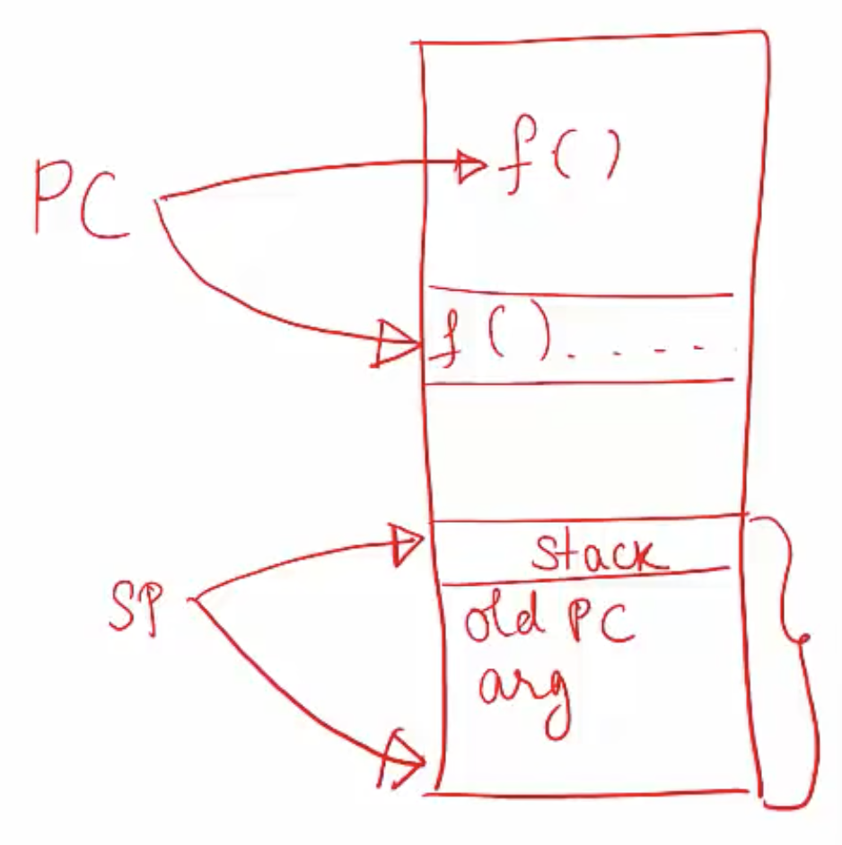
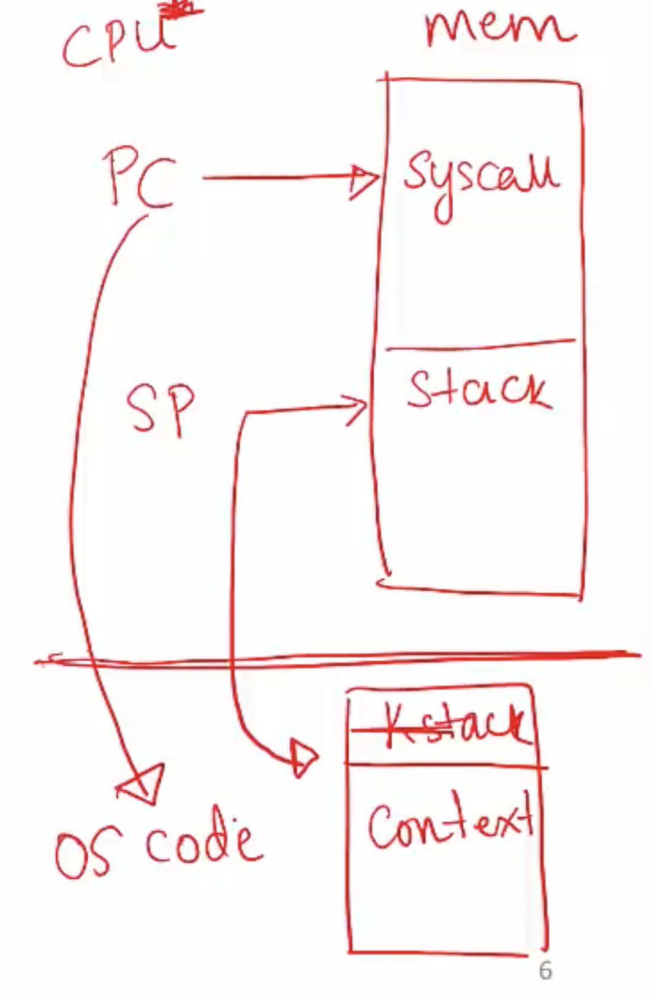

**Content to be learnt in this lecture: low-level mechanisms**
- How does the OS run a process?
- How does it handle a system call?
- How does it context switch from one process to the other?

**Process Execution**
- OS allocates memory and creates memory image
    * Code and data (from exe)
    * Stack and heap
- Points CPU program counter to current instruction, stack pointer to current position in the stack
  - Other registers may store operands, return values etc. 
- After setup, OS is out of the way and process executes directly on CPU (PC points to an instruction, CPU fetches that instruction, decodes and executes, moves on to the next instruction)

**A simple function call**
- A function call translates to a jump instruction
- A new stack frame pushed to stack and stack pointer (SP) updated
- Old value of PC (return value) pushed to stack and PC updated
- Both these changes are reversed (stack frame popped, PC back to old PC) at the end of the function call
- Stack frame contains return value, function arguments etc

**How is a system call different?** 
- CPU hardware has multiple privilege levels
  - One to run user code: user mode
  - One to run OS code like system calls: kernel mode
  - Some instructions execute only in kernel mode
- Kernel does not trust user stack
  - Uses a separate kernel stack when in kernel mode
- Kernel does not trust user provided addresses to jump to 
  - Kernel sets up Interrupt Descriptor Table (IDT) at boot time
  - IDT has addresses of kernel functions to run for system calls and other events

**Mechanism of system call: trap instruction**

- When system call must be made, a special trap instruction is run (usually hidden from user by libc)
- Trap instruction execution
    * Move CPU to higher privilege level
    * Switch to kernel stack (update SP)
    * Save context (old PC, registers) on kernel stack
    * Look up address in IDT and jump to trap handler function in OS code (update PC)

**More on the trap instruction**

- Trap execution is executed on hardware in following cases:
    * System call (program needs OS service)
    * Program fault (program does something illegal, eg. access memory it doesn't have access to)
    * Interrupt (external device needs attention of OS, eg. a network packet has arrived on network card)
- Across all cases, the mechanism is: save context on kernel stack and switch to OS address in IDT
- IDT has many entries: which to use?
  - System calls/interrupts store a number in a CPU register before calling a trap, to identify which IDT entry to use

**Return from trap**
- When OS is done handling syscall or interrupt, it calls a special instruction return-from-trap
    * Restore context of CPU registers from kernel stack
    * Change CPU privilege from kernel mode to user mode
    * Restore PC and jump to user code from trap
- User process unaware that it was suspended, resumes execution as always
- Must you always return to the same user process from kernel mode? No
- Before returning to user mode, OS checks if it must switch to another process

**Why switch between processes?**
- Sometimes when OS is in kernel mode, it cannot return back to the same process it left
    * Process has exited or must be terminated (eg. segfault)
    * Process has made a blocking system call
- Sometimes, the OS does not want to return back to the same process
    * The process has run for too long
    * Must timeshare CPU with other processes
- In such cases, OS performs a context switch to switch from one process to another

**The OS scheduler**
- OS Scheduler has two parts
    * Policy to pick which process to run (next lecture)
    * Mechanism to switch to that process (this lecture)
- Non preemptive (cooperative) schedulers are polite
    * Switch only if process blocked or terminated
- Preemptive (non-cooperative) schedulers can switch even when process is ready to continue
    * CPU generates periodic timer interrupt
    * After serviving interrupt, OS checks if the current process has run for too long

**Mechanism of context switch**
- Example: process A has moved from user to kernel mode, OS decides it must switch from A to B
- **Save context (PC, registers, kernel stack pointer) of A on kernel stack**
- **Switch SP to kernel stack of B**
- **Restore context from B's kernel stack**
- Who has saved registers on B's kernel stack?
    * OS did it, when it switched out B in the past
- Now, CPU is running B in kernel mode, return-from-trap to switch to user mode of B

**A subtlety on saving context**
- Context (PC and other CPU registers) saved on the kernel stack in two different scenarios
- **When going from user mode to kernel mode**, user context (eg. which instruction of user code you stopped at) is saved on kernel stack by the trap instruction
    * Restored by return-from-trap
- **During a context switch**, kernel context (eg. where you stopped in the OS code) of process A is saved on the kernel stack of A by the context switching code
    * Restores kernel context of process B