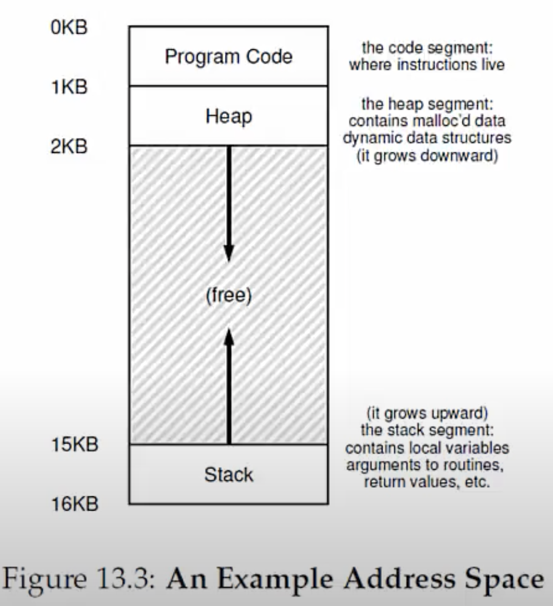
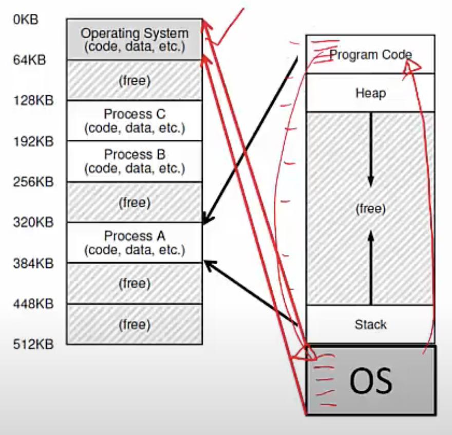

**Why virtualize memory?**

- Because real view of the memory is messy!
- Earlier, memory had only code of one running process (and OS code)
- Now, multiple active processes timeshare CPU
    * Memory of many processes must be in memory
    * Non-contiguous too
- Need to hide this complexity from user (when you're writing code, you don't want to be worried about into how many pieces will my code be broken into, where will my code reside in main memory etc)

**Abstraction: (Virtual) Address Space**
- Virtual address space: every process assumes it has access to a large space of memory from address 0 to a MAX
- Contains program code (and static data), heap (dynamic allocations) and stack (local variables, arguments to routines, return values- used during function calls)
    * Stack and heap grow during runtime
- CPU issues loads and stores to <u>virtual addresses</u>

**How is actual memory reached?**
- Address translation from virtual addresses (VA) to physical addresses (PA)
    * CPU issues loads/stores to VA but memory hardware accesses PA
- OS allocates memory and tracks location of processes
- Translation done by memory hardware called <u>Memory Management Unit (MMU)</u>
    * OS makes the necessary information available
- So when CPU tries to access main memory, for eg. "get me the instruction at virtual address 100", there is a piece of hardware which is sitting in between which is called the MMU that translates the virtual address into physical address. 

**Example: Paging**
- OS divides virtual address into fixed size pages, physical memory into frames
- To allocate memory, a page is mapped to a free physical frame
- Page table stores mappings from virtual page number to physical frame number for a process (eg. page 0 to frame 3)
- MMU has access to page tables, and uses it to translate VA to PA

**Goals of memory virtualization**
- Transparency: user programs should not be aware of the messy details
- Efficiency: minimize overhead and wastage in terms of memory space (want to pack the memory image of the process (code, data, heap, stack) in memory as efficiently as possible) and access time (you don't want this translation process to take too much time)
- Isolation and protection: a user process should not be able to access anything outside its address space

**How can a user allocate memory?**
- OS allocates a set of pages to memory image of the process
- Within this image
    * Code is being assigned addresses by the compiler during compilation
    * Static/global variables are allocated in the executable, during compilation
    * Local variables of a function on stack
    * Dynamic allocation with malloc on the heap
- In your program, depending on how you have created your variable (global variable? function? is it a variable created using malloc?), memory will be allocated in different parts of the memory image of the process
- When you malloc, memory is allocated from the heap while the program is running, whereas if you just declare a static/global variable, then that memory is allocated, when you compile the program, in the executable itself. 

**Memory allocation system calls**
- malloc implemented by C library (NOT a system call)
    * this implementation involves algorithms for efficient memory allocation and free space management
- To grow heap after the heap is full of malloc'd memory, libc uses the brk/sbrk system call 
    * Discouraged from using this system call directly in the program, leave it to the C library. You just use malloc, the C library will take care of growing the heap as needed.
-  A program can also allocate a page sized memory using the mmap() system call
    * Gets "anonymous" page from OS
    * You can store anything you want in this page
    * Again, something for advanced programmers if you don't want to use malloc. 

**A subtle point: what is the address space of the OS?**
- When a process makes a system call and wants to run OS code, where is the OS code run? Is it part of the address space of the same process, or is it a different address space?
- OS is not a separate process with its own address space
- Instead, OS code is part of the address space of every process
- A process sees OS as part of its code (eg. library)

- Any time you want to make a system call, you simply jump to the OS code, run this code, and then go back again. 
- In the background, OS ensures that every process thinks the OS code is part of its image, but in reality, there is only copy of OS code in memory
- Page tables map the OS addresseses to OS code

**How does the OS allocate memory?**
- OS needs memory for its data structures
- For large allocations, OS allocates a page
- For smaller allocations, OS uses various memory allocation algorithms (more later)
    * Cannot use libc and malloc in kernel!
    * libc only available to C programs 
    * Within the kernel, it needs to implement its own functionality to allocate memory

