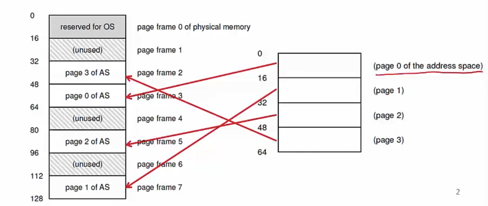
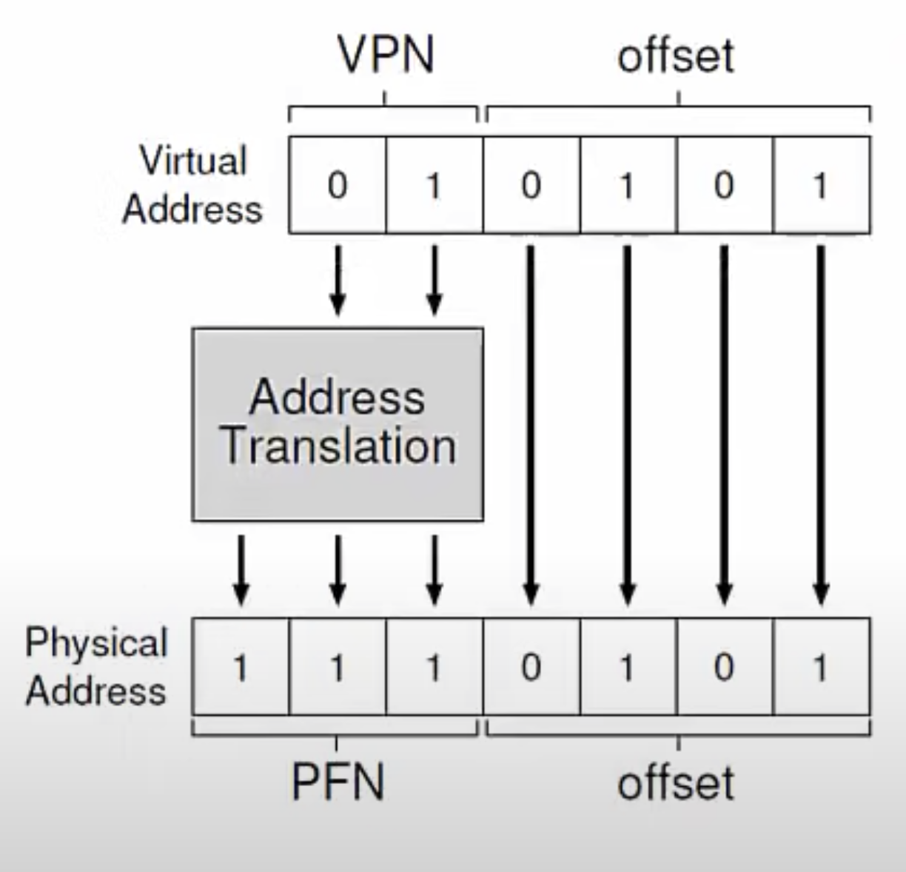
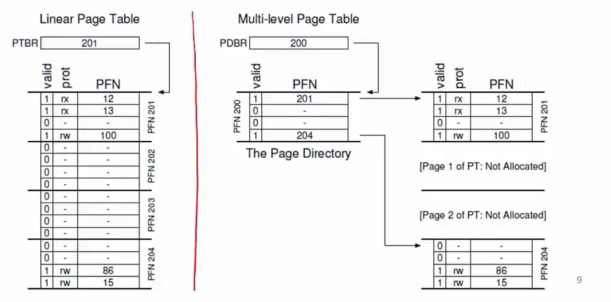
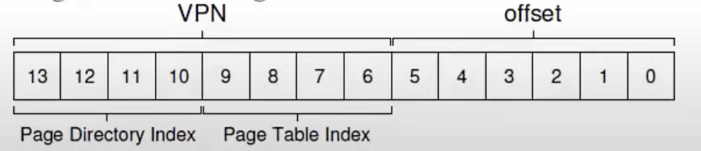

**Paging**
- Most common memory management technique in modern OSes
- Allocate memory in fixed size chunks("pages")
- Avoids external fragmentation (no small "holes")
- Has internal fragmentation (partially filled pages)

**Page table**
- <u>Per process</u> data structure to help VA-PA translation
- Array stores mapping from virtual page number (VPN) to physical frame number (PFN)
    * Eg. VP 0 -> PF 3, VP 1 -> PF 7
- Part of OS memory (in PCB)
- MMU has access to page table and uses it for address translation
- <u>OS updates page table upon context switch</u>
  
**Page table entry (PTE)**
- Simplest page table: linear page table
- Page table is an array of page table entries, one per virtual page
- VPN (virtual page number) is index into this array
- Each PTE contains PFN (physical frame number) and few other bits
    * Valid bit: is this page used by process?
    * Protection bit: read/write permissions
    * Present bit: is this page in memory? (more later)
    * Dirty bit: has this page been modified
    * Accessed bit: has this page been recently accessed?

**Address translation in hardware**
- Most significant bits of VA give the VPN
- Page table maps VPN to PFN
- <u>PA is obtained from PFN and offset within a page</u>
- MMU stores (physical) address of start of page table, not all entries
- "Walk" the page table to get relevant PTE
  

**What happens on memory access?**
- CPU requests code or data at a virtual address
- CPU -> MMU -> Memory
- MMU must translate VA to PA
    * First, access memory to read page table entry
    * Translate VA to PA
    * Then, access memory to fetch code/data
- Paging adds overhead to memory access
- Solution? A cache for VA-PA mappings
    - You shouldn't have to go to the page table in memory every time 
    - Instead, most recent mappings that you have read from the page table are stored in a cache by the MMU

**Translation Lookaside Buffer (TLB)**
- A cache of recent VA-PA mappings
- To translate VA to PA, MMU first looks up TLB
- If TLB hit, PA can be directly used
- If TLB miss, then MMU performs additional memory accesses to "walk" page table
- TLB misses are expensive (multiple memory accesses)
  * Locality of reference helps to have high hit rate 
- TLB entries may become invalid on context switch and change of page tables
- TLB, in most architectures, is managed by the hardware. OS only provides the page table, MMU sometimes uses the page table, sometimes it uses its own cache in the form of TLB. 

**How are page tables stored in memory?**
- What is typical size of page table?
    * 32 bit VA, 4KB (2^12) pages, so 2^32/2^12 = 2^20 entries
    * If each PTE is 4 bytes, then page table is 4MB (4*2^20)
    * One such page table per process!
- How to reduce the size of page tables?
    * Larger pages, so fewer entries
- How does OS allocate memory for such large tables?
    * Page table is itself split into smaller chunks

**Multilevel page tables**
- A page table is spread over many pages
- An "outer" page table or page directory tracks the PFNs of the page table pages
  

- Depending on how large the page table is, we may need more than 2 levels also
    * 64-bit architectures may need 7 levels
- What about address translation?
    * First few bits of VA to identify outer page table entry
    * Next few bits to index into next level of PTEs

- In case of TLB miss, multiple accesses to memory required to access all the levels of page tables
