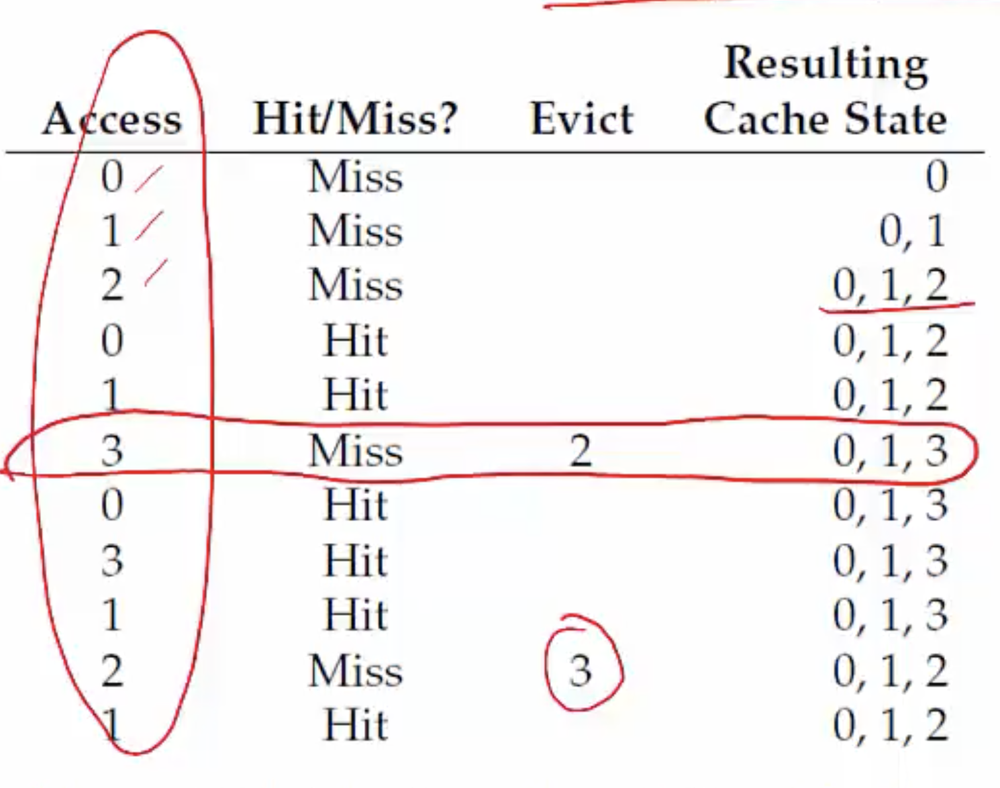
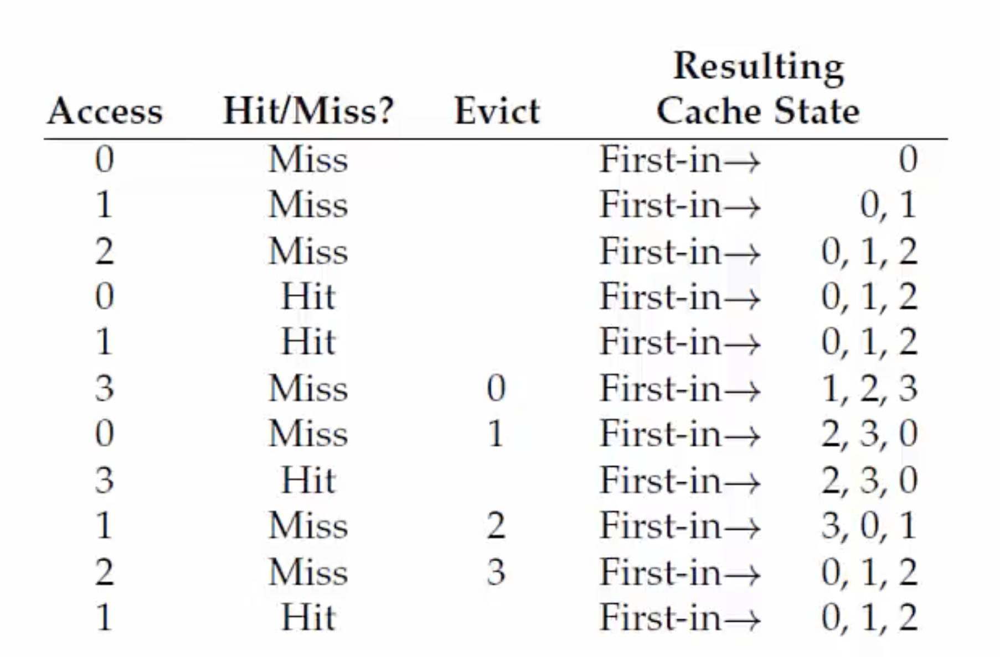
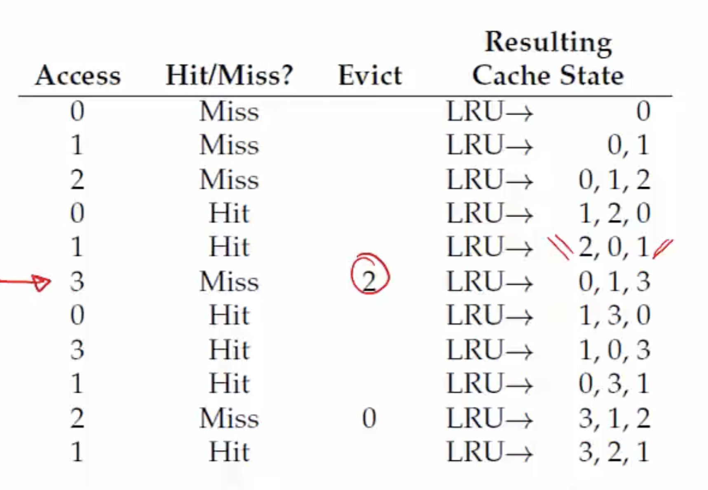

**Is main memory always enough?**
- Are all pages of all active processes always in main memory?
    * Not necessary, with large address spaces which means many pages per process
- OS uses a part of disk (swap space) to store pages that are not in active use (CPU not currently executing)

**Page fault**
- Present bit in page table entry: indicates if a page of a process resides in memory or not
- When translating VA to PA, MMU reads present bit
- If page present in memory, directly accessed
- If page not in memory, MMU cannot go and read the disk, so it raises a trap to the OS- page fault

**Page fault handling**
- Page fault traps OS and moves CPU to kernel mode
- OS fetches disk address of page (where is the page stored in swap disk) and issues read to disk
    * OS keeps track of disk addresses (say, in page table)
- OS context switches to another process
    * Current process is blocked and cannot run
- When disk read completes, the disk will raise an interrupt, OS updates page table of process (I've got so and so page and placed it in this frame number), and marks it as ready
- When process scheduled again, OS restarts the instruction that caused page fault

**Summary: what happens on memory access**
- CPU issues load to a VA for code or data
    * Checks CPU cache first
    * Goes to main memory in case of cache miss
- MMU looks up TLB for VA
    * If TLB hit, obtains PA, fetches memory location and returns to CPU (via CPU caches)
    * IF TLB miss, MMU accesses memory, walks page table, and obtains page table entry
        + If present bit set in PTE, accesses memory
        + If not present but valid, raises page fault. OS handles page fault and restarts CPU load instruction
        + If invalid page access, trap to OS for illegal access 

**More complications in a page fault**
- When servicing page fault, what if OS finds that there is no free page to swap in the faulting page?
- OS must swap out an existing page (if it has been modified, i.e. dirty) and then swap in the faulting page - too much work!
- OS may proactively swap out pages to keep list of free pages handy
- Which pages to swap out? Decided by page replacement policy.

**Page replacement policies**
- Optimal: replace page not needed for longest time in future (not practical, how do we know which pages are going to be accessed in the future)
- FIFO: replace page that was brought into memory earliest (may be a popular page! :( the page that you want to kick out is a page that won't use too often)
- LRU/FU: replace the page that least recently(or frequently) used in the past (if a page has not been used recently in the past, it is unlikely that it will be used in the future)

**Example: Optimal policy**
- Example: 3 frames for 4 pages (0, 1, 2, 3)
- First few accesses are cold (compulsory) misses

**Example: FIFO**
- Usually worse than optimal
- Belady's anomaly: performance may get worse when memory size increases (the first page that you are evicting may be a popular page)
  

**Example: LRU**
- Equivlent to optimal in this simple example
- Works well due to locality of references 

**How is LRU implemented?**
* Most OSes use some variant of LRU that is practical enough to be implemented
- OS is not involved in every memory access - how does it know which page is LRU?
- Hardware help and some approximations
- MMU sets a bit in PTE ("accessed" bit) when a page is accessed
- OS periodically looks at this bit to estimate pages that are active and inactive
- To replace, OS tries to find a page that does not have access bit set
    * May also look for page with dirty bit not set (to avoid swapping out to disk)

