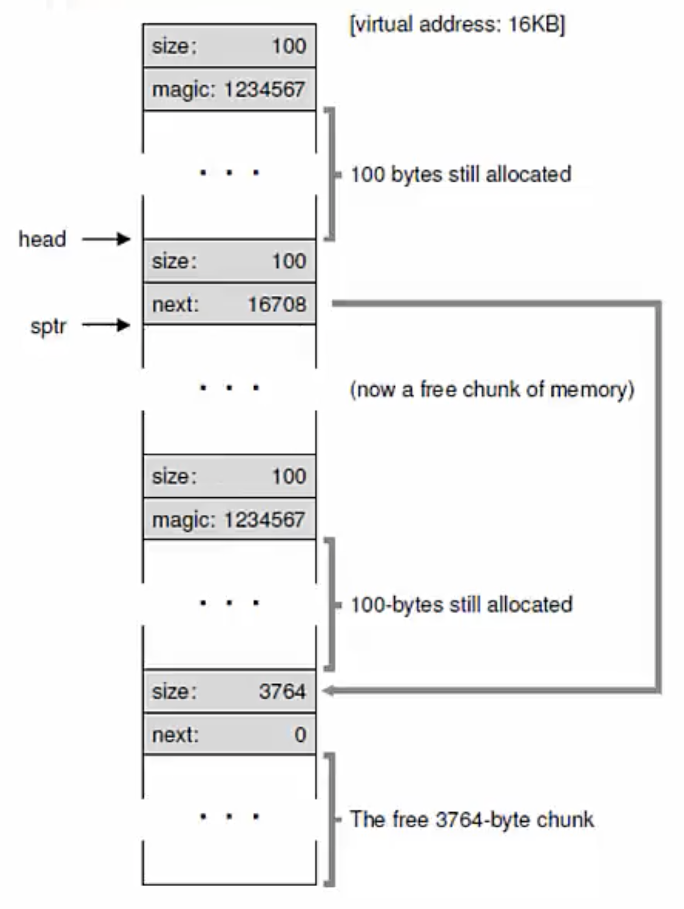

**Variable sized allocation**

- Given a block of memory, how do we allocate it to satisfy various memory allocation requests?
- This problem must be solved in the C library
    * Allocates one or more pages from kernel via brk/sbrk or mmap system calls
    * Gives out smaller chunks to user programs via malloc
- This problem also occurs in the kernel
    * Kernel must allocate memory for its internal data structures

**Variable sized allocation: headers**
- Consider a simple implementation of malloc
- Every allocated chunk has a header with info like size of chunk
    * Why store size? We should know how much to free when free() is called

- The key point to note is that in addition to the memory returned to you, there is also memory consumed by the header which is used by the C library 

**Free list**
- Free space is managed as a list
    * Pointer to the next free chunk is embedded within the free chunk
- The library tracks the head of the list
    * Allocations happen from the head

- After allocation of 100 bytes, head of the free list moved down. Next field points to the next place chunk of free memory, if current is the last chunk, next is 0. 

**External fragmentation**

- Suppose 3 allocations of size 100 bytes each happen
- Then, the middle chunk pointed to by sptr is freed
- What is the free list?
    * It now has two non-contiguous elements
- Free space may be scattered around due to fragmentation
    * Cannot satisfy a request for 3800 bytes even though we have the free space
    * This is the main problem of variable-sized allocation
    * Any memory allocation algorithm should try to avoid fragmentation as far as possible

**Splitting and Coalescing**
- Suppose all the three chunks are freed
- The list now has a bunch of free chunks that are adjacent
- A smart algorithm would merge them all into a bigger free chunk
- Must <u>split and coalesce</u> free chunks to satisfy variable sized requests

**Buddy allocation for easy coalescing**
- Allocate memory in size of power of 2
    * Eg. for a request of 7000 bytes, allocate 8KB chunk
- Why? 2 adjacent power-of-2 chunks can be merged to form a bigger power-of-2 chunk
    * Eg. if 8KB block and its "buddy" are free, they can form a 16KB chunk 

**Variable Size Allocation Strategies**
- First fit: allocate first free chunk that is sufficient
- Best fit: allocate free chunk that is closest in size
- Worst fit: allocate free chunk that is farthest in size

**Fixed size allocations**
- Memory allocation algorithms are much simpler with fixed size allocations
- Page-sized fixed allocations in kernel
    * Has free list of pages
    * Pointer to next page stored in the free page itself
    * Every time a request comes in for a page, allocate from the head of this free list
- For some smaller allocations (eg. PCB), kernel uses a <u>slab allocator</u>
    * Object caches for each type (size) of objects (for eg. a cache of all PCBs; when a request for a PCB data structure comes, kernel will allocate from this cache)
    * Within each cache, only fixed size allocation
    * Each cache is made up of one or more "slabs"
- Special use case: fixed size memory allocators can be used in user programs also (instead of generic malloc, which can be used to give you any size of memory, if you know that your program only allocates objects of 20 bytes, you can use a more optimized, fixed size memory allocator- something like a slab allocator; there are implementations of such things for user programs also)
