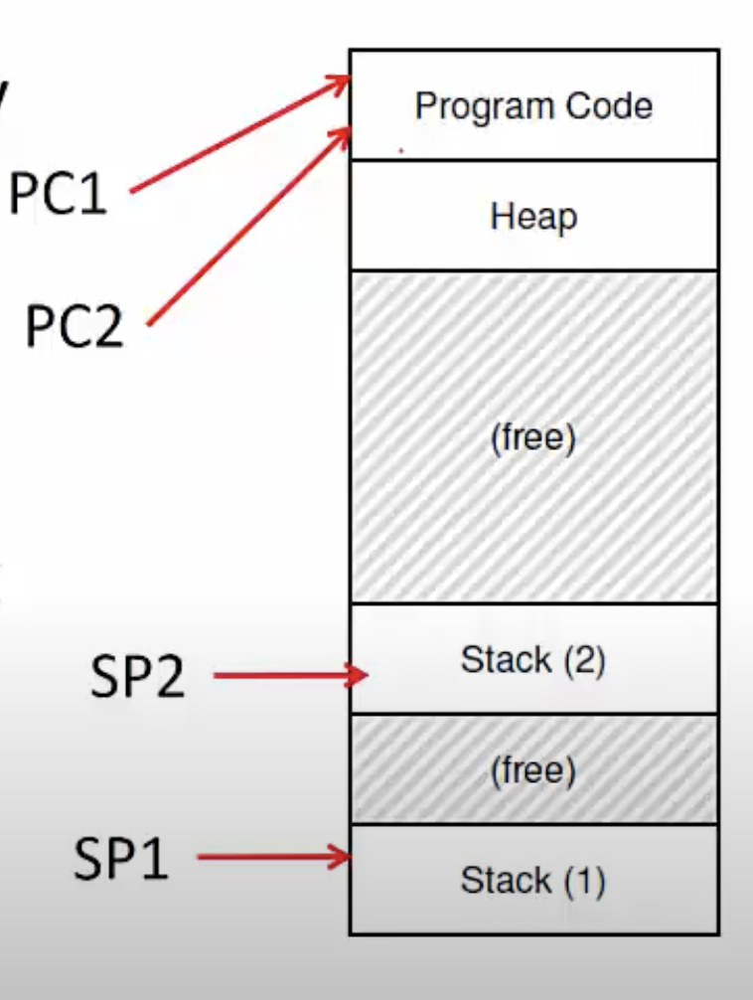
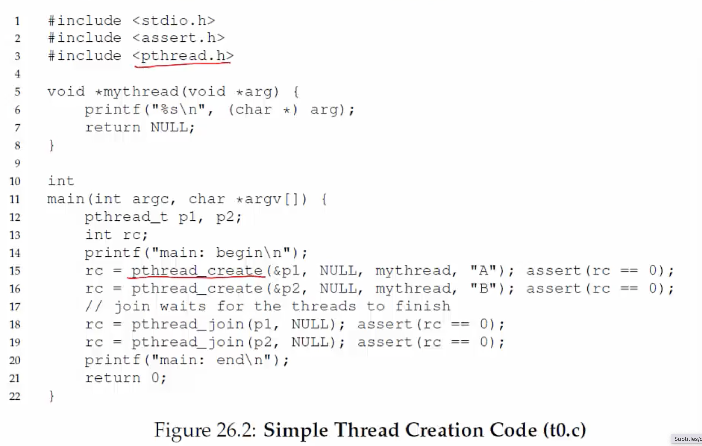
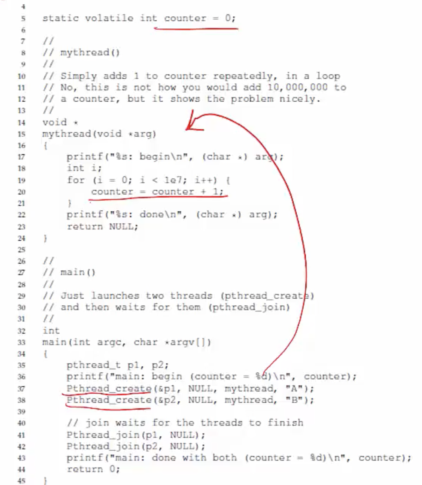
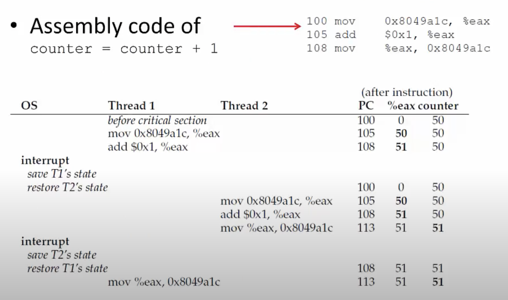

**Single threaded process**
- So far, we have studied single threaded programs
- Recap: process execution
    * PC points to current instruction being run
    * SP points to stack frame of current function call
- A program can also have multiple threads of execution
- What is a thread?

**Multi threaded process**
- A thread is like another copy of a process that executes independently
- <u>Threads share the same address space (code, heap)</u>
- Each thread has a separate PC
    * Each thread may run over different part of the program
- Each thread has separate stack for independent function calls
  

**Process vs threads**
- Parent p forks a child c
    * P and C do not share any memory
    * Need complicated IPC mechanisms to communicate
    * Extra copies of code, data in memory
- Parent p executes two threads T1 and T2
    * T1 and T2 share parts of the address space
    * Global variables can be used for communication
    * Smaller memory footprint
- <u>Threads are like separate processes, except they share the same address space</u>

**Why threads?**
- Parallelism: a single process can effectively utilize multiple CPU cores
    * Understand the difference between concurrency and parallelism
    * Concurrency: running multiple threads/ processes at the same time, even on single CPU core, by interleaving their executions
    * Parallelism: running multiple threads/processes in parallel over different CPU cores
- Even if no parallelism, concurrency of threads ensures effective use of CPU when one of the thread blocs (eg. for I/O)

**Scheduling threads**
- OS schedules threads that are ready to run independently, much like processes
- The context of a thread (PC, registers) is saved into/restored from thread control block (TCB)
    * Every PCB has one or more linked TCBs
- Threads that are <u>scheduled independently</u> by kernel are called kernel threads
    * Eg. Linux pthreads are kernel threads
- In contrast, some libraries provide user-level threads
    * User program sees multiple threads
    * Library multiplexes larger number of user threads over a smaller number of kernel threads
    * Low overhead of switching between user threads (no expensive context switch)
    * But multiple user threads cannot run in parallel (kernel only sees them as one thread even though the user sees them as multiple threads)
- By default, when we say a thread, it is a kernel level thread. When a process creates a thread, the kernel sees it as a separate entity that it can schedule independently. 

**Creating threads using pthreads API**

- There are 3 separate entitites: the process, T1 and T2. 

**Example: threads with shared data**

- What do we expect to be the final value of counetr? Two threads, each increments counter by 10^7, so 2*10^7
- Sometimes, a lower value. Why?

**What's happening?**

- We would have ideally wanted 52 for the final value of counter, but the executions overlapped. 

**Race conditions and synchronization**
- What just happened is called a <u>race condition</u>
    * Concurrent execution can lead to different results
- Critical section: portion of code that can lead to race conditions
- What we need: mutual exclusion
    * Only one thread should be executing critical section at any time
- What we need: atomicity of the critical section
    * The critical section should execute like one uninterruptible instruction
- How is it achieved? Locks (topic of next lecture)