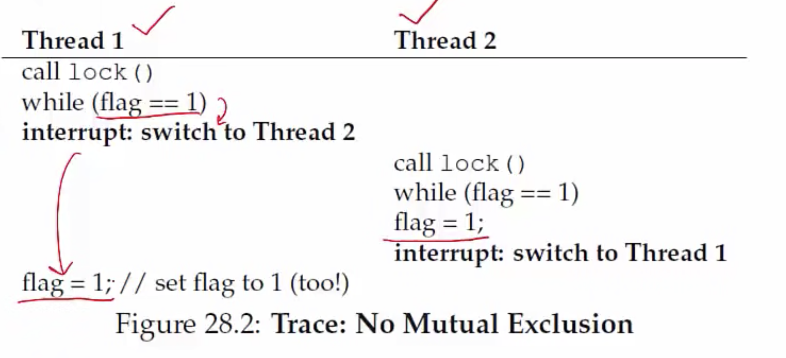

**Locks: Basic Idea**
- Consider update of shared variable
  ```c
  balance = balance + 1;
  ```
- We can use a special lock variable to protect it
    ```c
    lock_t mutex; // some globally-allocated lock 'mutex'
    ...
    lock(&mutex);
    balance = balance + 1; // critical section
    unlock(&mutex);
    ```
- All threads accessing a critical section share a lock
- One thread succeeds in locking- owner of lock
- Other threads that try to lock cannot proceed further until lock is released by owner
- Pthreads library in Linux provides such locks

**Building a lock**
- Goals of a lock implementation
    * Mutual exclusion (obviously!)
    * Fairness: all threads should eventually get the lock, and no thread should starve
    * Low overhead: acquiring, releasing and waiting for lock should not consume too many resources
- Implementation of locks are needed for both userspace programs (eg. pthreads library) and kernel code (for its own data structures)
- Implementing locks needs support from <u>hardware and OS</u>

**Is disabling interrupts enough?**
```c
void lock() {
  DisableInterrupts();
}
void unlock() {
  EnableInterrupts();
}
```
- Is this enough?
- No, not always!
- Many issues here:
    * Disabling interrupts is a privileged instruction and program can misuse it (eg. run forever)
    * <u>Will not work on multiprocessor system</u>, since another thread on another core can enter critical section
- This technique is used to implement locks on single processor systems inside the OS
  * Need better solution for other situations (user programs or multiprocessor systems)

**A failed lock implementation**
- Lock: spin on a flag variable until it is unset, then set it to acquire lock
- Unlock: unset flag variable
```c
typedef struct __lock_t { int flag; } lock_t;
void init(lock_t *mutex) {
  // 0 -> lock is available, 1 -> held
  mutex->flag = 0;
}
void lock(lock_t *mutex) {
  while (mutex->flag == 1) //TEST the flag
    ; //sping-wait (do nothing)
  mutex->flag = 1;
}
void unlock(lock_t *mutex) {
  mutex->flag = 0;
}
```
- What's the problem?
- Thread 1 spins, lock is released, ends spin
- Thread 1 interrupted just before setting flag but after exiting the while statemet. 
- Race conditioned has moved to lock acquisition code


- <u>No mutual exclusion</u>, both threads set flag to 1. 
- Ideally, you would have wanted checking the flag and then setting it to have happened atomically, but that didn't happen. 

**Solution: Hardware atomic instructions**
- Very hard to ensure atomicity only in software
- Modern architectures provide hardware atomic solutions
- Example of an atomic instruction: test-and=set
    * Update a variable and return old value, all in one hardware instruction
```c
int TestAndSet(int *old_ptr, int new) {
  int old = *old_ptr; // fetch old value at old_ptr
  *old_ptr = new;
  return old;
}
```

**Simple lock using test-and-set**
- If TestAndSet(flag, 1) returns 1, it means the lock is held by someone else, so wait busily. 
- This lock is called a spinlock- spins until lock is acquired

```c
typedef struct __lock_t {int flag;} lock_t;
void init(lock_t *lock) {
  // 0 indicates that lock is available, 1 that it is held
  lock->flag = 0;
}

void lock(lock_t *lock) {
  while (TestAndSet(&lock->flag, 1) == 1) 
    ; // spin-wait (do nothing)
}

void unlock(lock_t *lock) {
  lock-flag = 0;
}
```
- Because test-and-set is one instruction, nobody can interrupt you while you run that. 
- Other threads which want to acquire the lock are busy waiting. 

**Spinlock using compare-and-swap**

- Another atomic instruction: compare-and-swap
  ```c
  int CompareAndSwap(int *ptr, int expected, int new) {
    int actual = *ptr;
    if (actual == expected)
      *ptr = new;
    return actual;
  }
  ```
    * The above is the C code of CompareAndSwap to demonstrate what it does; in real life, it is a single hardware instruction
- Spinlock using compare-and-swap
  ```c
  void lock(lock_t *lock) {
    while (CompareAndSwap(&lock->flag, 0, 1) == 1)
      ; // spin
  }
  ```

**Alternative to spinning**

- Alternative to spinlock: a (sleeping) mutex
- Instead of spinning for a lock, a contending thread could simply give up the CPU and check back later
    * yield() moves thread from running to ready state
    * At a later point of time when it is scheduled by the OS, it will check again
```c
void init() {
  flag = 0;
}
void lock() {
  while (TestAndSet(&flag, 1) == 1)
    yield(); // give up the CPU
}
void unlock() {
  flag = 0;
}
```

**Spinlock vs sleeping mutex**
- Most userspace lock implementations are of the sleeping mutex kind
    * CPU wasted by spinning contending threads
    * More so if a thread holds spinlock (or the lock) and blocks other threads from accesing it for long
- Locks inside the OS are always spinlocks
    * Why? If OS yields, who will then take care of the hardware? A userspace program can yield and be like "I don't want to run, run some other process" but OS is the default software layer that is running on hardware, it should never yield. 
- When OS acquires a spinlock:
    * It must disable interrupts (on that processor core) while the lock is held. Why? An interrupt handler could request the same lock, and spin for it forever.
    * It must not perform any blocking operation- never go to sleep with a locked spinlock! Somebody else might request the same spinlock and they will keep spinning forever, control will never come back to OS to release the spinlock. 
- In general, use spinlocks with care, and release as soon as possible. 
- So to implement locks in OS:
    * single processor: just disabling interrupts does the job
    * multiprocessor: spinlock + disabling interrupts

**How should locks be used?**
- A lock should be acquired before accessing any variable or data structure that is shared between multiple threads of a process
    * "Thread-safe" data structures mean internally the data structures are using a certain lock so that if multiple threads call the same functions, mutual exclusion is guaranteed
- All shared kernel data structures must also be accessed only after locking
- Coarse-grained vs fine-grained locking: one big lock for all shared data vs separate locks
    * Fine-grained allows more parallelism
    * Multiple fine-grained locks may be harder to manage
- OS only provides locks, correct locking discipline is left to user