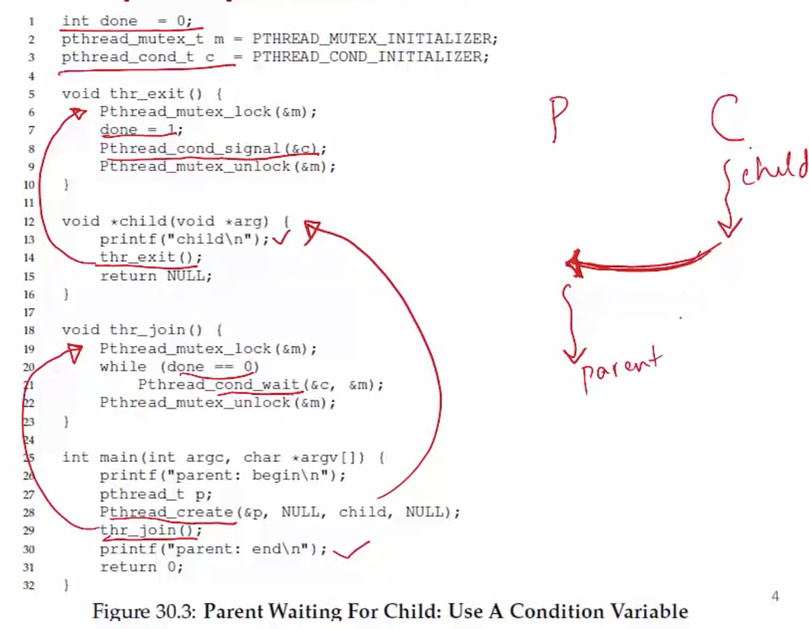
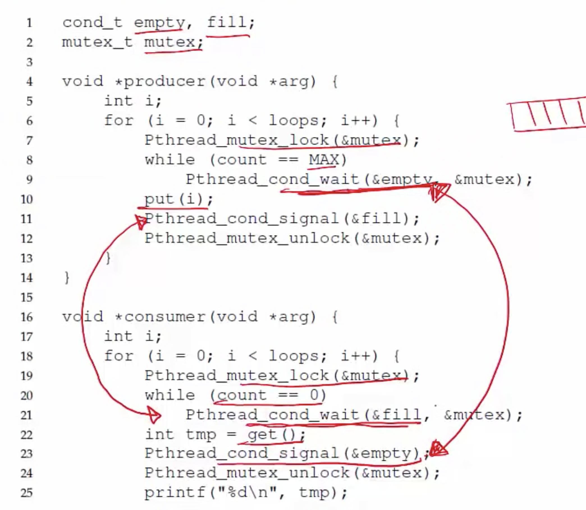

**Another type of synchronization**

- Locks allow one type of synchronization between threads- mutual exclusion
- Another common requirement in multi-threaded applications- <u>waiting and signaling</u>
    * eg. thread t1 wants to continue only after t2 has finished some task
- Can accomplish this by busy-waiting on some variable, but inefficient
- Need a new schronization primitive: condition variables

**Condition Variables**
- A condition variable (CV) is a queue that a thread can put itself into when waiting on some condition
- Another thread that makes the condition true can signal the CV to wake up a waiting thread
- Pthreads provides CV for user programs
    * OS has a similar functionality of wait/signal for kernel threads
- Signal wakes up one thread, signal broadcast wakes up all waiting threads

**Example: parent waits for child**



- "child" will be printed before "parent: end" no matter in which order the OS schedules schedules the parent and the child.

**Why check condition in while loop?**
- In the example code, why do we check condition before calling wait?
    * In case the child has already run and done is true, then no need to wait
- Why check condition with "while" loop and not "if"?
    * To avoid corner cases of thread being woken up even when condition not true (<u>may be an issue with some library implementations</u>)
```c
if (condition)
    wait(condvar)
// small chance that condition may be false when wait returns

while (condition)
    wait(condvar)
// condition guaranteed to be true since we check in while-loop
```

**Why use lock when calling wait?**
- What is no lock is held when calling wait/signal?
```c
void thr_exit() {
    done = 1;
    Pthread_cond_signal(&c);
}
void thr_join() {
    while (done == 0) 
        Pthread_cond_wait(&c);
}
```
- Race condition: missed wakeup
    * Parent checks done to be 0, decides to sleep, but interrupted before calling Pthread_cond_wait
    * Child runs, sets done to 1, signals but no one sleeping yet
    * Parent now resumes and goes to sleep forever
- What went wrong? You don't want to be interrupted between checking done == 0 and calling wait Pthread_cond_wait, both of them should be executed atomically.  
- Lock must be held when calling wait and signal with condition variable
- The wait condition releases the lock before putting thread to sleep, so lock is available for signalling thread

**Example: Producer/Consumer problem**
- A common pattern in multi-threaded programs
- Example: in a multi-threaded web server, one thread accepts requests from the network and puts them in queue. Worker threads get requests from this queue and process them. 
- Setup: one or more producer threads, one or more consumer threads, a shared buffer of bounded size. 

**Producer/Consumer with 2 CVs**


- Lock is important because at one point of time, either producer should be adding to the queue or consumer should be taking from the queue. 