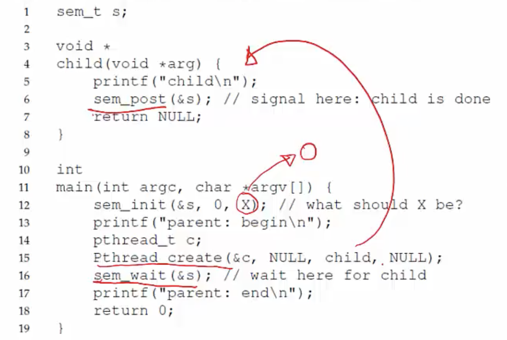
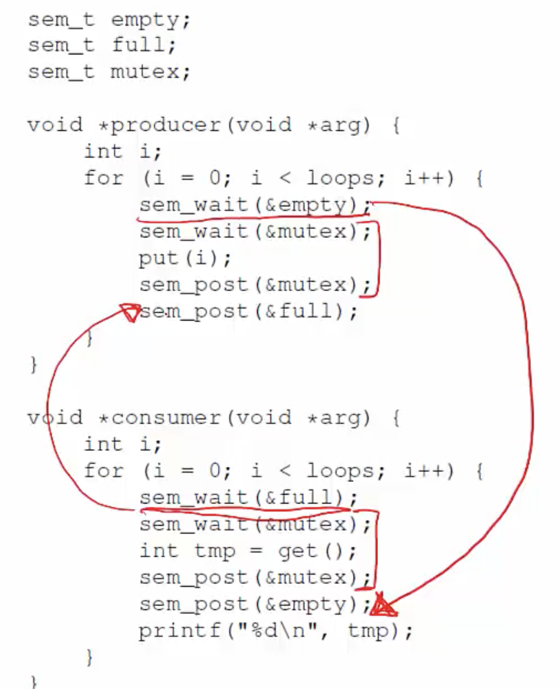
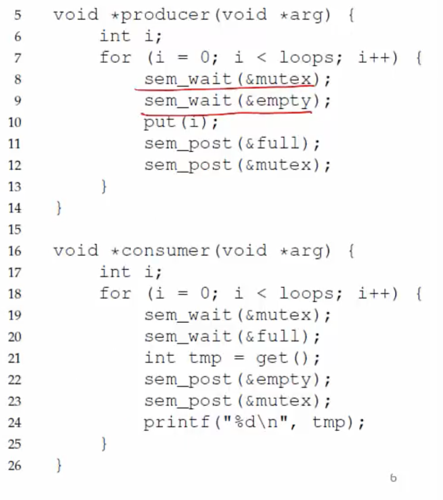

**What is a semaphore?**
- Synchronization primitive like condition variables
- Semaphore is a variable with an underlying counter
- Two functions on a semaphore variable
    * Up/post increments the counter
    * Down/wait decrements the counter and blocks the calling thread if the resulting value is negative
- A semaphore with init value 1 acts as a simple lock (binary semaphore = mutex)
```c
sem_t m;
sem_init(&m, 0, X); // initialize sempahore to X; what should X be? If binary semaphore, then 1. 

sem_wait(&m);
//critical section here
sem_post(&m);
```

**Semaphores for ordering**
- Can be used to set order of execution between threads like CV
- Example: parent waiting for child (init=0)



**Example: Producer/Consumer**
- Need two semaphores for signalling
    * One to track empty slots, and make producer wait if no more empty slots
    * One to track full slots, and make consumer wait if no more full slots
- One semaphore to act as mutex for buffer
```c
int main(int argc, char *argc[]) {
    // ...
    sem_init(&empty, 0, MAX); //empty is initializied with MAX value; producers need to keep decrementing it until no more empty slots
    sem_init(&full, 0, 0); // full is initialized with 0, at the start no consumer can take anything from the buffer. As producer adds to the buffer, full is incremented. 
    sem_init(&mutex, 0, 0); //mutex = 1 because it is a look
    // ....
}
```
- We need a binary semaphore (equivalent to a mutex) for the shared buffer. With CVs, we had 2 CVs and 1 mutex; now we have 3 semaphores. 

**Producer/Consumer using semaphores**



**Incorrect solution with deadlock**



- What if lock is acquired before signaling (calling wait on mutex before calling wait on empty and wait on full)
- Waiting thread sleeps with mutex and the signaling thread can never run to wake it up since the waiting thread has the mutex
- So anytime you are calling wait on a semaphore, remember that you could get blocked and make sure you are not holding any other extra locks that might be needed by people who have to wake you up