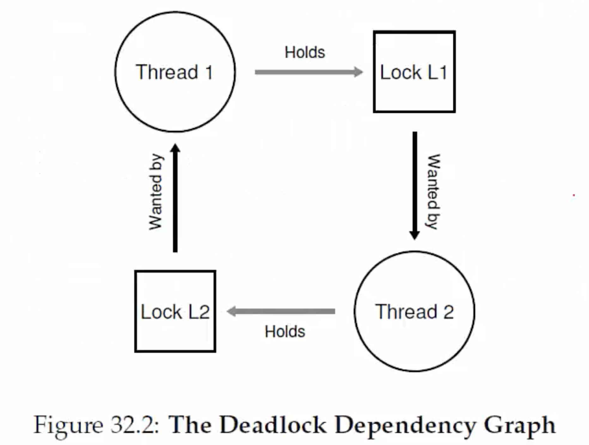
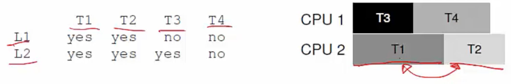

**Bugs in concurrent programs**
- Writing multi-threaded programs is tricky
- Bugs are non-deterministic (sometimes occur, sometimes do not) and occur based on execution order of threads - very hard to debug
- Two types of bugs
    * Deadlocks: threads cannot execute any further and wait for each other
    * Non-deadlock bugs: non deadlock but incorrect results when threads execute (the earlier example of incrementing a shared counter w/u using deadlocks)

**Non-deadlock bugs**
- Atomicity bugs- atomicity assumptions made by programmer are violated during execution of concurrent threads
    * Fix: locks for mutual exclusion
- Order-violation bugs- desired order of memory accesses is flipped during concurrent execution (programmer implicity assumes thread A runs, does something, then thread B runs, but sometimes OS may schedule thread B first)
    * Fix: condition variables

**Atomicity bug: example**
- One thread reads and prints a shared data item, while another concurrently modifies it
```c
Thread 1::
if (thd->proc_info) {
    ...
    fputs(thd->proc_info, ...);
    ...
}

Thread 2::
thd->proc_info = NULL;
```
- Thread 1 first checks if proc_info is not NULL, and then prints it, but before thread 1 prints it, an interrupt happens and thread 2 sets it to NULL, and when thread 1 tries to print it, there occurs a segmentation fault because it is trying to print a NULL value. 
- Thread 1 code by itself is correct, it first checked proc_info was not NULL before printing it, but it made an assumption that all of the piece of code was atomic/ that no one will interrupt them there. 
-  Atomicity bugs can occur not just when writing to shared data, but even when reading it

**Atomicity bug example: fix**
- <u>Always use locks when accessing shared data</u>.
```c
pthread_mutex_t proc_info_lock = PTHREAD_MUTEX_INITIALIZER;

Thread 1::
pthread_mutex_lock(&proc_info_lock);
if (thd->proc_info) {
    ...
    fputs(thd->proc_info, ...);
    ...
}
pthread_mutex_unlock(&proc_info_lock);

Thread 2::
pthread_mutex_lock(&proc_info_lock);
thd->proc_info = NULL;
pthread_mutex_unlock(&proc_info_lock);
```
   
**Order violation bug: example**
- Thread 1 assumes thread 2 has already run
```c
Thread 1::
void init() {
    ...
    mThread = PR_CreateThread(mMain, ...);
    ...
}

Thread 2::
void mMain(...) {
    ...
    mState = mThread->State;
    ...
}
```
- No assumptions can be made on order of execution of concurrent threads

**Order violation bug example: fix**
- Use condition variables or semaphores
```c
pthread_mutex_t mtLock = PTHREAD_MUTEX_INITIALIZER;
pthread_cond_t mtCond = PTHREAD_COND_INITIALIZER;
int mtInit = 0;

Thread 1::
void init() {
    ...
    mThread = PR_CreateThread(mMain, ...);

    // signal that the thread has been created
    pthread_mutex_lock(&mtLock);
    mtInit = 1;
    pThread_cond_signal(&mtCond);
    pThread_mutex_unlock(&mtLock);
    ...
}

Thread 2::
void mMain(...) {
    ...
    // wait for the thread to be initialized
    pthread_mutex_lock(&mtLock);
    while(mtInit == 0) 
        pthread_cond_wait(&mtCond, &mtLock);
    pthread_mutex_unlock(&mtLock);

    mState = mThread->State;
    ...
}
```

**Deadlock bugs**
- Classic example: Thread 1 holds lock L1 and is waiting for lock L2. Thread 2 holds L2 and is waiting for L1. 
```c
Thread 1:
pthread_mutex_lock(L1);
pthread_mutex_lock(L2);

Thread 2:
pthread_mutex_lock(L2);
pthread_mutex_lock(L1);
```
- Deadlock need not always occur. Only occurs if executions overlap and context switch from a thread after acquiring only one lock. 

**Deadlock: a visual representation**
- Cycle in a dependency graph
  


**Conditions for deadlock**
- Mutual exclusion: a thread claims exclusive control of a resource (eg. lock)
- Hold-and-wait: thread holds a resource and is waiting for another
- No preemption: thread cannot be made to give up its resource (eg. cannot take back a lock)
- Circular wait: there exists a cycle in the resource dependency graph
- ALL four of the above conditions must hold for a deadlock to occur

**Preventing circular wait**
- <u>Acquire locks in a certain fixed order</u>
    * Eg. both threads acquire L1 before L2
- Total ordering (or even a partial ordering on related locks) must be followed
    * Eg. order locks by address of lock variable
```c
if (m1 > m2) { // grab locks in  high-to-low address order
    pthread_mutex_lock(m1);
    pthread_mutex_lock(m2);
} else {
    pthread_mutex_lock(m2);
    pthread_mutex_lock(m1); 
}
// Code assumes that m1 != m2 (it is not the same lock)
```

**Preventing hold-and-wait**
- <u>Acquire all locks at once, say, by acquiring a master lock first</u>
- But this method may reduce concurrent execution and performance gains
```c
pthread_mutex_lock(prevention); // begin lock acquisition
pthread_mutex_lock(L1); 
pthread_mutex_lock(L2);
...
pthread_mutex_unlock(prevention); // end 
```

**Other solutions to deadlocks**
- Deadlock avoidance: if OS knew which process needs which lock, it can schedule the processes in that deadlock will not occur
    * Banker's algorithm is very popular, but impractical in real life to assume this knowledge (OSes dont know which locks the process wants to acquire)
    * Example, below are locks needed by threads and a possible schedule decided by OS 
    
- Detect and recover: today, when most OSes detect a deadlock, they either reboot system or kill deadlocked processes