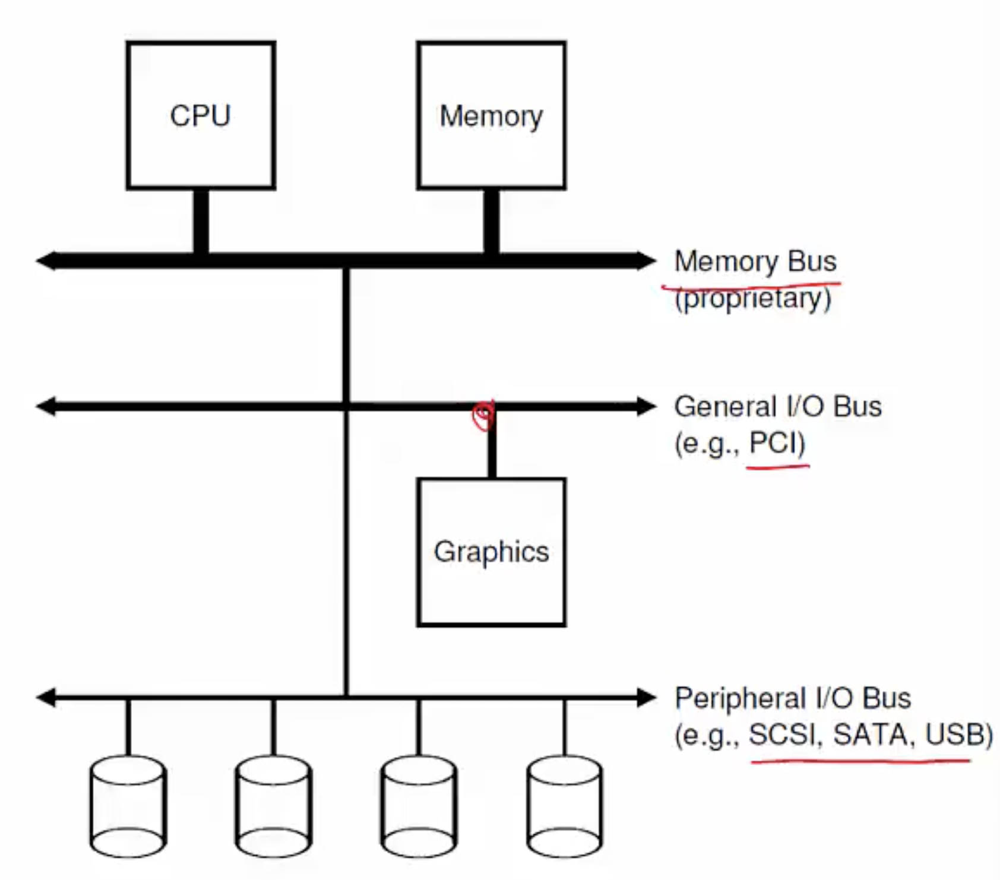
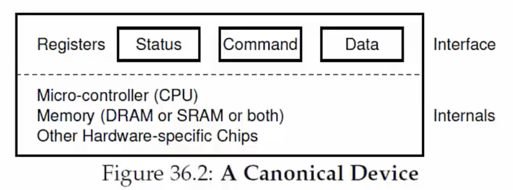
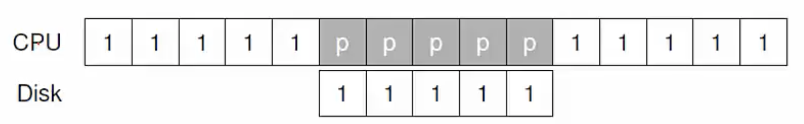
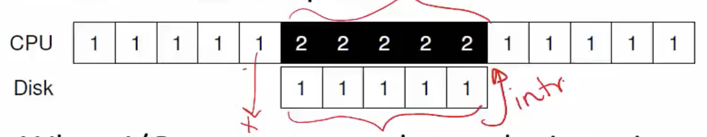
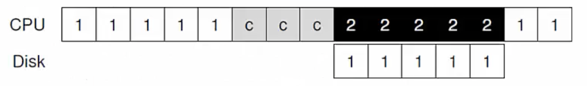
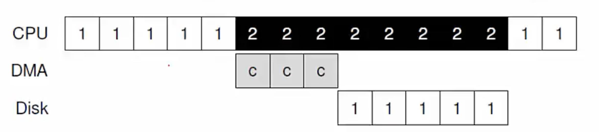
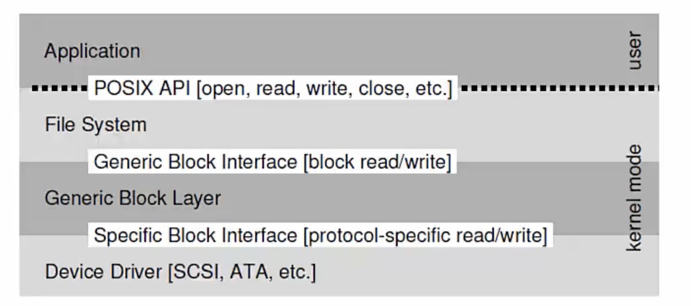

**Input/Output Devices**
- I/O devices connect to the CPU and memory via a bus
    * High speed bus, eg. PCI
    * Other: SCSI, USB, SATA
- Point of connection to the system: port
    * I/O device connects via bus to a port on the machine



**Simple Device Model**
- Block devices store a set of numbered blocks (disks)
- Character devices produce/consume stream of bytes (keyboard)
- Devices expose an interface of memory registers to the OS
    * Current status of device
    * Command to execute
    * Data to transfer
- The internals of device are usually hidden from the OS
- - OS communicates with the device through these registers in the interface
    

**How does OS read/write to registers?**
- Explicit I/O instructions
    * Eg. on x86, in and out instructions can be used to read and write to specific registers on a device
    * These are of course privileged instructions accessed by OS
- Memory mapped I/O
    * Devices makes registers appear like memory locations
    * OS simply reads and writes from memory
    * Memory hardware routes accesses to these special memory addresses to the registers on the interface of the device
        + Certain part of memory address space is reserved for I/O devices

**A simple execution of I/OP requests**
```
While (STATUS == BUSY)
    ; // wait until device is not busy
Write data to DATA regsiter
Write command to COMMAND register
    (Doing so starts the device and executes the command)
While (STATUS == BUSY)
    ; // wait until device is doen with your request
```
- The inefficiencies of this simple execution:
    * Polling status (the "while status == busy" statement) to see if device ready - wastes CPU cycles
    * Programmed I/O- CPU explicitly copies data to/from device- wastes a lot of CPU cycles on a very simple task
- Modern techniques which fix these inefficiencies will come up next

**Interrupts**
- Polling wastes CPU cycles
  
- Instead, OS can put process to sleep and switch to another process
  
- When I/O request completes, device raises interrupt

**Interrupt handler**
- Interrupt switches process to kernel mode
- Interrupt Descriptor Table(IDT) stores pointers to interrupt handlers (interrupt service routines)
    * Interrupt (IRQ) number identifies the interrupt handler to run for a device
- Interrupt handler acts upon device notification, unblocks the process waiting for I/O (if any), and starts next I/O request (if any pending)
- Handling interrupts imposes kernel mode transition overheads
    * Note: polling may be faster than interrupts if device is fast

**Direct Memory Access (DMA)**
- CPU cycles wasted in copying data to/from device
    
- Instead, a special piece of hardware (DMA engine) copies from main memory to device
    * CPU gives DMA engine the memory location of data
    * In case of read, interrupt raised after DMA completes copying received data from device to main memory
    * In case of write, disk starts writing after DMA completes

    
- Ends up saving significant amounts of CPU cycles

**Device Driver**
- Device driver: part of OS code that talks to <u>specific device</u>, gives commands, handles interrupts etc
- Most OS code abstracts the device details
    * Eg. file system code is written on top of a generic block interface 
  

