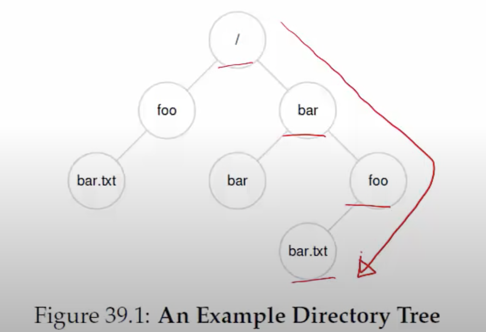
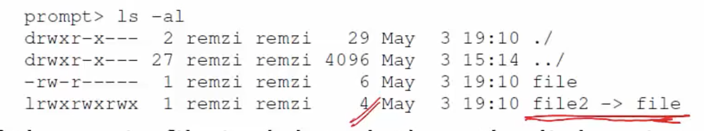
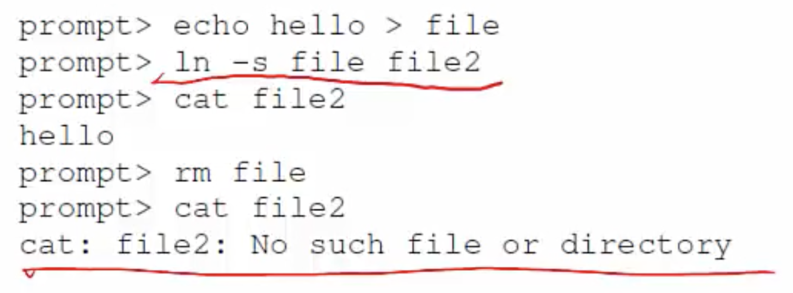

**The file abstraction**

- File- linear array of bytes, stored persistently
    * Identified with file name (human readable) and a OS-level identifier ("inode number")
    * Inode number unique within a file system
- Directory contains other subdirectories and files, along with their inode numbers
    * Stored like a file, whose contents are filename-to-inode mappings

**Directory tree**
- Files and directories arranged in a tree, starting with root("/")
  


**Operations on files**
- Creating a file
    * open() system call with flag to create
    * Returns a number called "file descriptor"
    ```c
    int fd = open("foo", O_CREAT|O_WRONLY|O_TRUNC, S_IRUSR|S_IWUSR);
    ```
- Opening a file
    * Existing files must be opened before they can be read/written
    * Also uses open system call, and returns fd
- <u>All other operations on files use the file descriptor</u>
- close() system call closes the file
- Reading/writing files: read()/write() system calls
    * Arguments: file descriptor, buffer with data, size
- Reading and writing happens sequentially by default
    * Successive read/write calls fetch from current offset
- What if you want to read/write at random location
    * lseek() system call lets you seek to random offset
- Writes are buffered in memory temporarily, so fsync() system call flushes all writes to disk
- Other operations: rename file, delete(unlink) file, get statistics of a file

**Operations on directories**
- Directories can also be accesses like files
    * Operations like create, open, read, close
- For example, the following "ls"-like program opens and reads all directory entries
    * Directory entry contains file name, inode number, type of file (file/directory) etc. 
```c
int main(int argc, char *argv[]) {
    DIR *dp = opendir(".");
    assert(dp!=NULL);
    struct dirent *d;
    while ((d = readdir(dp)) != NULL) {
        printf("%lu %s\n", (unsigned long) d->d_ino, d->d_name);
    }
    closedir(dp);
    return 0;
}
```

**Hard links**
- Hard linking creates another file that points to the same inode number (and hence, same underlying data)
    ```c
    prompt> echo hello > file
    prompt> cat file
    hello
    prompt> ln file file2 // this links file to file2
    prompt> cat file2
    hello
    prompt> ls -i file file2 // shows inode numbers of file and file2
    67158084 file
    67158084 file2
    ```
- If one file deleted, file data can be accessed through the other links
    ```c
    prompt> rm file
    removed 'file'
    prompt> cat file2
    hello
    ```
- Inode maintains a link count, file data deleted only when no further links to it
- <u>You can only unlink, OS decides when to delete</u>

**Soft links or symbolic links**
- Soft link is a file that simply stores a pointer to another filename

- If the main file is deleted, then the link points to an invalid entry: dangling reference

- Soft link is an alias to a file and simply stores mapping between two different names; it is not a separate hard link to the underlying inode

**Mounting a file system**
- Mounting a filesysytem connects the files to a specific point in the directory tree
```c
prompt> mount -t ext3 /dev/sda1 /home/users
prompt>ls /home/users
a b
```
- So when you mount a file system, you can access all the files in that file system from the mount point 
- Several devices and file systems are mounted on a typical machine, accessed with mount command
    * there are multiple disks, each of which is running a different kind of file system

**Memory mapping a file**
- Alternate way of accessing a file, instead of using file descriptors and read/write syscalls
- mmap() allocates a page in the virtual address space of a process
    * "Anonymous" page: used to store program data
    * In contrast to anonymous page, <u>file-backed page</u>: contains data of file (filename provided as arg to mmap)
- When file is mmaped, file data copied into one or more pages in memory
- Makes it much more convenient to read/write a file, can simply access the file as if it is a memory location in your program