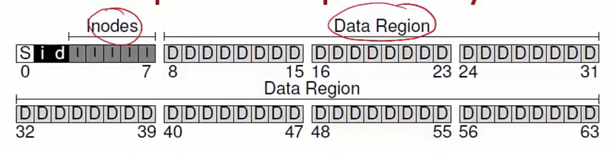
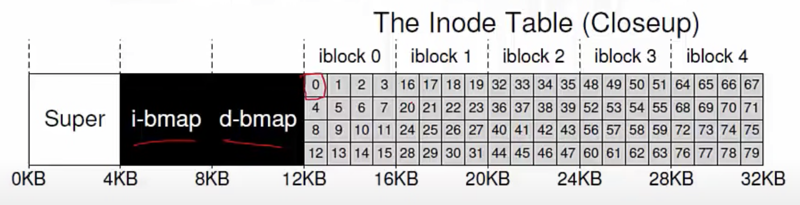
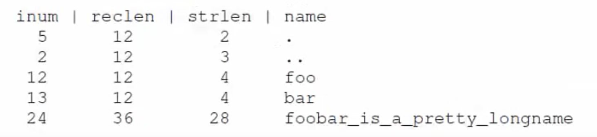

**File System**
- An organization of files and directories on disk
- OS has one or more file systems
- Two main aspects of file systems
    * Data structures to organize data and metadata on disk
    * Implementation of system calls like open, read, write using the data structures
- Disks expose a set of blocks (usually 512 bytes)
- File system organizes files onto blocks
    * System calls translated into reads and writes on blocks

**Example: a simple file system**

- <u>Data blocks</u>: file data stored in one or more blocks
- Metadata about every file stored in <u>inode</u>
    * Location of data blocks of a file, permissions etc.
- <u>Inode blocks</u>: each block has one or more inodes
- <u>Bitmaps</u>: indicate which inodes/data blocks are free
- <u>Superblock</u>: holds master plan of all other blocks (which are inodes, which are data blocks etc.)

**Inode table**
- Usually, inodes (index nodes) stored in array
    * Inode number of a file is indexed into this array
  

- What does inode store?
    * File metadata: permissions, access time, etc. 
    * Pointers (disk block numbers) to file data

**Inode structure**
- File data not stored contiguously on disk, need to track multiple block numbers of a file
- The most important function of an inode is to store pointers of the data blocks of the file
- How does inode track disk block numbers?
    * Direct pointers: numbers of first few blocks are stored in inode itself (suffices for small files)
    * Indirect block: for larger files, inode stores number of indirect block, which has block numbers of file data
    * Similarly, double and triple indirect blocks (multi-level index)

**File Allocation Table (FAT)**
- <u>Alternate way to track file blocks</u>
- FAT stores next block pointer for each block
    * FAT has one entry per disk block
    * Entry has number of next file, or null (if last block)
    * Pointer to first block stored in inode, all other block numbers can be known by falling the pointers

**Directory structure**
- Directory stores records <u>mapping filename to inode number</u>, eg, as shown below
    
- Linked list of records, or more complex structures (hash tables, binary search trees etc.) to store the filename to inode number mappings
- Directory is a special type of file and has inode and data blocks (which store the file records)

**Free space management**
- How to track free blocks?
    * Bitmaps, for inodes and data blocks, store one bit per block to indicate if free or not
    * Free list, super block stores pointer to first free block, a free block stores address of next block on list
    * More complex structures can also be used

**Opening a file**
- Why open? To have the inode readily available (in memory) for future operations on file
    * Open returns fd which points to in-memory inode
    * Reads and writes can access file data from inode
- What happens during open? The goal of open is to locate the inode of a file. 
    * The pathname of the file is traversed, starting at root
    * Inode of root is known, to bootstrap the traversal
    * Recursively do: fetch inode of parent directory, read its data blocks, get inode number of child, fetch inode of child. Repeat until end of path. Copy the inode into memory. 
    * If new file, new node and data blocks will have to be allocated using bitmap, and directory entry updated

**Open file table**
- Global open file table
    * One entry for every file opened (even sockets, pipes)
    * Entry points to in-memory copy of inode (other data structures for sockets and pipes)
- Per-process open file table
    * Array of files opened by a process
    * File descriptor number is index into this array
    * Per-process table entry points to global open file table entry, and then the global entry points to the inode
    * Every process has three files (standard in/out/err) open by default (fd 0, 1, 22)
- Open system call creates entries in both tables and returns fd number
- So from the fd number, you can locate the inode of the open file

**Reading and writing a file**
- For reading/writing a file
    * Access in-memory inode via file descriptor
    * Find location of data block at current read/write offset
    * Fetch block from disk and perform operation
    * Writes may need to allocate new blocks from disk using bitmap of free blocks
    * Update time of access and other metadata in inode
- Key takeaway is that any file operation will require multiple accesses to the disk

**Virtual File System**
- File systems differ in implementations of data structures (eg. organization of file records in directory- one file system may store filename to inode number mappings as linked list, other may use a hash table)
- <u>Linux supports virtual file system (VFS) abstraction</u>
- VFS looks at a file system as objects (files, directories, inodes, superblock) and operations on these objects (eg. lookup filename in directory)
- <u>System call logic is written on VFS objects</u>
- To develop a new file system, simply implement functions on VFS objects and provide pointers to these functions to kernel
- <u>Syscall implementation does not have to change with file system implementation details</u>

**Disk buffer cache**
- Results of recently fetched disk blocks are cached
    * LRU to evict if cache is full
- File system issues block read/write requests to block numbers via buffer cache
    * If block in cache, served from cache, no disk I/O
    * If cache miss, block fetched to cache and returned to file system
- Writes are applied to cache block first
    * Synchronous/write-through cache writes to disk immediately
    * Asynchronous/write-back cache stores dirty block in memory and writes back after a delay 

**Disk buffer cache**
- Unified page cache in OS
    * Free pages allocated to both processes and disk buffer cache from common pool
- Two benefits
    * Improved performance due to reduced disk I/O (one disk access for multiple reads and writes)
    * Single copy of block in memory (no consistency among processes)
- Some applications like databases may avoid caching altogether, to avoid inconsistencies due to crashes: direct I/O
