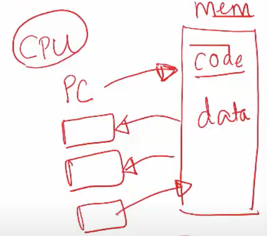

**What is an operating system?**
- Middleware between user programs and system hardware. 
- Manages hardware: CPU, main memory, IO devices (disk, network card, mouse, keyboard etc.)

**What happens when you run a program? (Background)**

- A compiler translates high level programs into an executable (".c" to "a.out")
- The exe contains instructions that the CPU can understand, and data of the program (all numbered with addresses)
- Instructions run on CPU, and they are specific to the underlying CPU hardware. Every CPU has a certain instruction set architecture (ISA), a set of instructions that it can implement. 
- The compiler therefore translates a program into these instructions that can be executed on a particular CPU
- In addition to the hardware to execute instructions, CPU also consists of a few registers, eg:
    * Pointer to current instruction (program counter or PC)
    * Operands of instructions, memory addresses
- The executable contains the instructions and the data of the program

**So, what happens when you run a program?**

- To run an exe, CPU
    * fetches instruction pointed at by PC from memory
    * loads data required by the instructions into registers
    * decodes and executes the instruction
    * stores results to memory 

- An execution of a program has this back and forth between CPU and memory, where the CPU is fetching instructions, executing them and storing back results into memory.
- Most recently used instructions and data are in <u>Instruction Cache</u> and <u>Data Cache</u> for faster access. 

**So, what does the OS do?**

- OS manages the program memory
    * Loads program executable (code, data) from disk to memory
- OS manages CPU
    * Initializes program counter (so that program counter is pointing to the instruction to run) and other registers to begin execution
- OS manages external devices
    * Read/write files from disk
    
**OS manages CPU on behalf of the process**

- OS provides the process abstraction
    * Process: a running program
    * OS creates and manages processes
- Each process has the illusion of having the complete CPU, i.e. OS virtualizes CPU
- Timeshares CPU between processes
- Enables coordination between processes

**OS manages memory on behalf of the process**

- OS manages the memory of the process: code, data, stack, heap
- Each process thinks it has the entire memory space for itself, numbers code and data starting from 0 (virtual addresses)
- OS abstracts out the details of the actual placement in memory, translates from virtual addresses to physical addresses
- The process does not need to worry about the nitty-gritties of where its memory is placed in the actual physical hardware

**OS manages devices on behalf of the process**

- OS has code to manage disk, network card, and other external devices: device drivers
- OS has device drivers, which talk the language of the hardware devices
    * Issues instructions to devices (fetch data from a file)
    * Responds to interrupt events from devices (user has pressed a key on the keyboard; the keyboard talks to the device driver and the device driver understands what key you have pressed)
- Persistent data organized as a filesystem on a disk

**Design goals of an operating system**

- Convenience, abstraction of hardware resources for user programs
- Efficiency of usage of CPU, memory etc
    * When processes are being run on a CPU, OS tries to ensure that the CPU is efficiently utilized
    * When OS is storing the memory of processes in the physical RAM, it makes sure that not a lot of space is wasted. 
- Isolation between multiple processes

**History of operating systems**

- Started out as a library, a set of functions which conveniently abstract out the hardware and that can be reused among programs
- Later, evolved from a procedure call (just a function call) to system call (today if you want to invoke OS services, you invoke a system call): what's the difference? 
- When a system call is made to run OS code, the CPU executes at a higher privilege level
- Evolved from running a single program to multiple processes concurrently
- Nobody no longer directly runs their code on the hardware, they always go via an operating system because it is very convenient