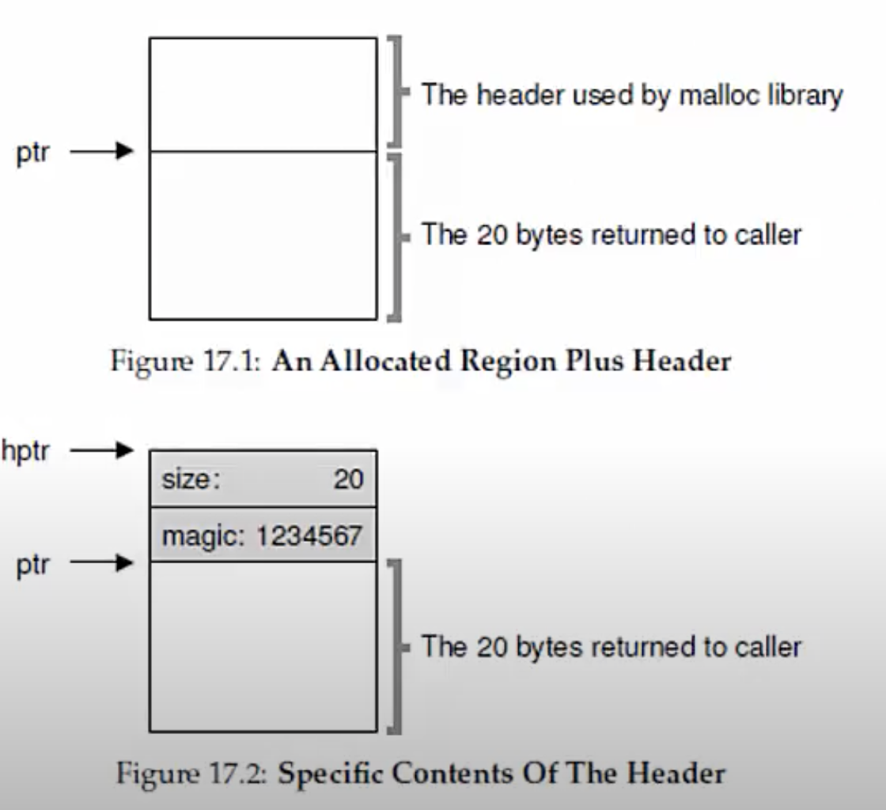
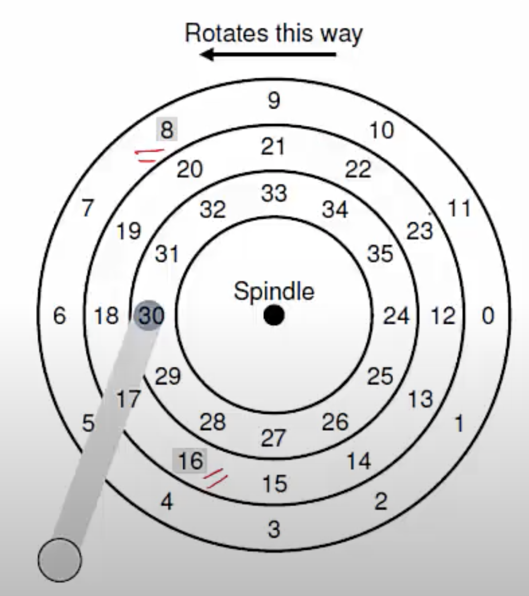

**Hard Disk**
- Interface: a set of 512-byte blocks (sectors), that can be read or written atomically (you cannot read a part of a block, you must either read or write a full block/sector to the disk)
- Internals: one or more platters, connected by a spindle, spinning at ~10K RPM (rotations per minute)
- Each platter has a disk head and arm
- A platter is divided into multiple tracks, and each track into 512-byte sectors

**What happens when accessing a sector?**
- Suppose disk head at 30, need to access 11
- Seek to the correct track, wait for disk to rotate

**Time taken for I/O operation**
- Time taken to read/write a block consists of 
    * Seek time to get to the right track (few ms)
    * Rotational latency for disk to spin to correct sector on the track (few ms)
    * Transfer time to read sector (few tens microsec, much less than seek + rotaional)
- Given high seek and rotational latency, usually rate of sequential access > rate of random access
- All disks try to maximize sequential access
- OSes also perform various optimizations to maximize sequential access

**Disk Scheduling**
- Requests to disk are not served in FIFO, they are reordered with other pending requests
- Why? In order to read blocks in sequence as far as possible, to minimize seek time and rotational delay
- Who does scheduling? OS does not know internal geometry of disk, so scheduling done mostly by disk controller

**Shortest Seek Time First (SSTF)**
- Access block that we can seek to fastest
    * Go to block that is one track away before to that which is two tracks away
- Problem: starvation (some requests that are far from current position of head may never get served)

**Elevator/SCAN algorithm**
- Disk head does one sweep over tracks and serves requests that fall on the path
- Elevator/SCAN: sweep outer to inner, then inner to outer
- C-SCAN: sweep only one direction (say, outer to inner) and circle back, start again
    * Why? Sweeping back and forth favors middle tracks more
- F-SCAN: freeze queue (do not take any incoming requests) while scanning
    * Why? Avoid starving far away requests
- All these are variants but the high level idea of this is go back and forth across all tracks and serve requests which are on the path

**Shortest Positioning Time First (SPTF)**
- Considers both seek time and rotational latency
  

    * Better to serve 8 before 16, even though seek time is higher
    * Why? 16 incurs a much higher rotational latency

**Data storage on disk**
- Bits stored on disk with some error detection/correction bits
    * Correct random bit flips
    * Detect corruption of data
- Disk controller or OS can handle some error (eg. blacklisting certain sectors)
- If errors cannot be masked, user perceives hard disk failures
- Technologies such as RAID(Redundant Array of Inexpensive Disks) provide high reliability by replicating across multiple disks
