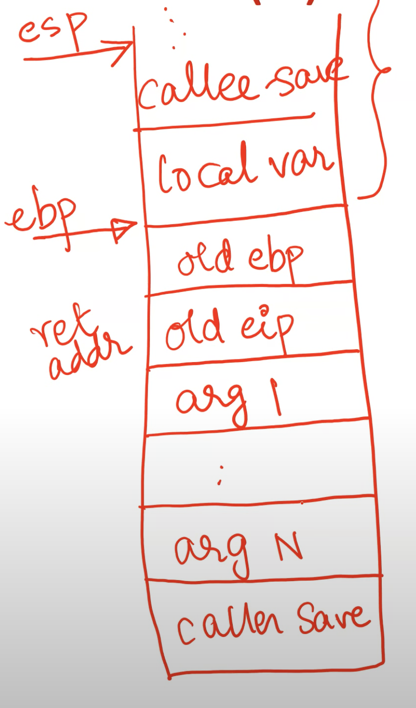

**Understanding OS concepts using xv6**
- Deep dive into OS concepts using xv6 as example
- xv6 is a simple OS for easy teaching of OS concepts
    * Two versions, one for x86 hardware and one for RISC-V hardware
    * This series of lectures based on x86 version
    * https://github.com/mit-pdos/xv6-public
- This lecture: overview of x86 hardware and other background needed to understand xv6 code

**Understanding xv6: background**
- OS enables processes stored in memory to run on CPU
    * Process's code/data stored in main memory
    * CPU fetches, decodes, executes instructions in program code
    * Process data fetched from memory to CPU registers for faster access during instruction execution
    * Recently fetched code/data stored in CPU caches for future access (memory access is very slow compared to CPU)
- What we will cover in this lecture
    * Common x86 registers
    * Common x86 instructions
    * How stack is used during function calls (C calling convention)

**Memory image of a process**
- Process memory image consists of
    * compiled code (CPU instructions)
    * global/static variables (memory allocated at compile time)
    * heap (dynamic memory allocation via eg. malloc) that grows on demand
    * stack (temporary storage during function calls eg. local variables) that usually grows "up" towards lower addresses
    * Other things like shared libraries
- Every instruction/data has an address, used by CPU to fetch/store
    * Virtual addresses (managed by OS)
- Example: can understand what is happening with variable "iptr"?
```c
int *iptr = malloc(sizeof(int));
```
- iptr is a local variable on the stack, while the address pointed to by iptr is on the heap

**x86 registers: example**
- Small space for data storage within CPU
- General purpose registers: store data during computations (eax, ebx, ecx, edx, esi, edi)
- Pointers to stack locations: base of stack (ebp) and top of stack (esp)
- Program counter or instruction pointer (eip): next instruction to execute
- Control registers: hold control information or metadata of a process (eg. cr3 has pointer to page table)
- Segment registers (cs, ds, es, fs, gs, ss): information about segments (related to memory of process)

**x86 instructions: exmaples**
- Load/store: mov src, dst (AT&T syntax)
    * mov %eax, %ebx (copy contents of eax to ebx)
    * mov (%eax), %ebx (copy contents from the main memory, address of which is stored in eax, into ebx)
    * mov 4(%eax), %ebx (copy contents stored at offset of 4 bytes from address stored at eax into ebx)
- Push/pop on stack: changes esp
    * push %eax (push contexts of eax onto stack, update esp)
    * pop %eax (pop top of stack onto eax, update esp)
- jmp sets eip to specified address
- call to invoke a function, ret to return from a function
- Variants of above (movw, pushl) for different register sizes

**Privilege levels**
- <u>x86 CPUs</u> have multiple privelege levels
    * Four "rings" (0 to 3)
    * Ring 0 has highest privilege, runs OS code
    * Ring 3 has lowest privilege, runs user code
- Two types of instructions: privileged and unprivileged
- Privileged instructions can be executed by CPU only when running at the highest privilege level (ring 0)
    * For eg, writing into cr3 register (setting page table) is privileged instruction, only )S should do it, because we do not want a user manipulating memory of another process
    * Another example: instructions to I/O devices
- Unprivileged instructions can be run at lower privilege levels
    * For eg, user code running at lower privilege can store a value into a general purpose register
- When user requires OS services (eg. system call), CPU movies to higher privilege level and executes OS code that contains privileged instructions
    * User code cannot invoke privileged instructions directly

**Function calls and the stack**
- Local variables, arguments stored on stack for duration of function call
- What happens in a function call?
    * Push function arguments on stack
    * call fn (instruction pushes fn) instruction pushes return address of stack, jumps to function
    * Allocate local variables on stack
    * Run function code
    * ret (instruction pops return address, eip goes back to old value)
- What about values in registers that existed before function call? Registers can get clobbered during a function call, so how can computation resume?
    * Some registers saved on stack by caller before invoking the function (caller save registers). Function code (callee) can freely change them, caller restores them later on. 
    * Some registers saved by callee function and restored after function ends (callee save registers). Caller expects them to have same value on return. 
    * Return value stored in eax register by callee (one of caller save registers, caller saves its previous value in stack and puts it back into the register after the end of the function call, allows for the callee to modify the register)
- All of this is automatically done by C compiler (C calling function)
- <u>Timeline of a function call</u> (note: stack grows from "up" from high to lower addresses- visually from low to high)
    * Push caller save register (eax, ecx, edx)
    * Push arguments in reverse order
    * Return address (old eip) pushed on stack by the call instruction
    * Push old ebp on stack
    * Set ebp to current top of stack (base of new "stack frame" of the functin)
    * Push local variables and callee save registers (ebx, esi, edi)
    * Execute function code
    * Pop stack frame and restore old ebp
    * Return address popped and eip restored by the ret instruction
- Stack pointers: ebp stores address of base of current stack frame and esp stores address of current top of stack
    * <u>Function arguments are accessible from looking under the stack base pointer</u>
  


**C vs assembly for OS code**
- Why all this x86 background?
    * Most of xv6 is in C, and assembly code (including all the stack manipulations for function calls) is automatically generated by the compiler
    * However, small parts are in assembly language. Why? Sometimes, OS needs more control over what needs to be done (for example, the logic of <u>switching from stack of one process to stack of another</u> cannot be written in a high-level language)
    * Basic understanding of x86 assembly language is required to follow some nuances of xv6 code

**More on CPU hardware**
- Some aspects of CPU hardware that are not relevant to studying OS:
    * CPU cache: CPU stores recently fetched instructions and data in multiple levels of cache. <u>OS has no visibility or control into the CPU cache</u>.
    * Hyper-threading: A CPU core can run multiple processes concurrently via hyper-threading. <u>From an OS perspective, 4-core CPU with 2 hyper-threads per core, and 8-core CPU with no hyper-threading will look the same</u>, even though performance may differ. OS will schedule in parallel on the 8 available processors. 