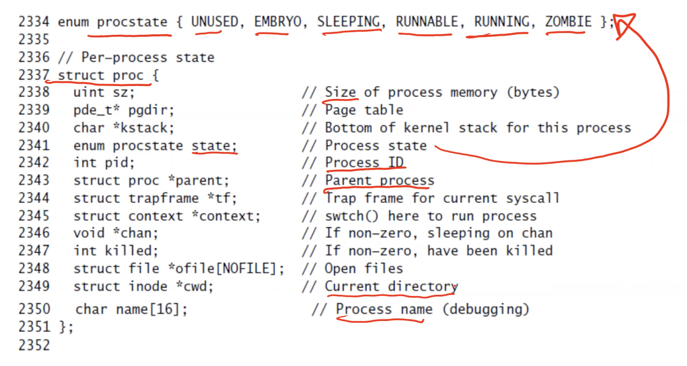

**The process abstraction**
- The OS is responsible for concurrently running multiple processes (on one or more CPU cores/processors)
    * Create, run, terminate a process
    * Context switch from one process to another
    * Handle any events (eg system calls from process)
- OS maintains all information about an active process in a process control block (PCB)
    * Set of PCBs of all active processes is a critical kernel data structure
    * Maintained as part of kernel memory (part of RAM that stores kernel code and data, more on this later)
- PCB is known by different names in different OS
    * struct proc in xv6
    * task_struct in Linux
- Within OS memory, there is a data structure that has a list of struct procs

**PCB in xv6: struct proc**
- Process structure and process states


**struct proc: kernel stack**
```c
char *kstack; //bottom of kernel stack for this process
```
- Recall: register state (CPU context) saved on user stack during function calls, to restore/resume later
- Likewise, CPU context stored on kernel stack when process jumps into OS to run kernel code
    * Why separate stack? OS does not trust user stack
    * Separate area of memory per process within the kernel, not accessible by regular user code
    * Linked from struct proc of a process

**struct proc: list of open files**
```c
struct file *ofile[NOFILE]; // open files
```
- <u>Array of pointers to open file</u> (struct file has information about the open file, more on this later)
    * When user opens a file, a new entry is created in this array, and the index of that entry is passed as a file descriptor to user
    * Subsequent read/write calls on a file use this file descriptor to refer ot the file
    * First 3 files (array indices 0, 1, 2) open by default for every process: standard input, output and error
    * Subsequent files opened by a process will occupt later entries in the array

**struct proc: page table**
```c
pde_t* pgdir; // page table
```
- Every instruction or data item in the memory image of a process (code/data, stack, heap, etc)
    * Virtual addresses, starting from 0
    * Actual physical addresses in memory can be different (all processes cannot store their instruction at address 0)
- Page table of a process maintains a mapping between the virtual addresses and physical addresses (more on this later)

**Process table (ptable) in xv6**
```c
struct {
    struct spinlock lock;
    struct proc proc[NPROC];
} ptable
```
- ptable: fixed-size array of <u>all processes</u>
    * real kernels have dynamic-sized data structures (xv6 is a small, simpler OS and therefore can affort to have a fixed-size array)
- CPU scheduler in the OS loops over all runnable processes, picks one, and sets it running on the CPU
```c
// loop over process table looking for process to run
acquire(&ptable.lock);
for (p=ptable.proc; p < &ptable.proc[NPROC]; p++) {
    if (p->state != RUNNABLE)
        continue;
    
    // switch to chosen process. it is the process's job to release ptable.lock and then reacquire it before jumping back to us
    c->proc = p;
    switchuvm(p);
    p->state = RUNNING;
}
```

**Process state transition examples**
- A process that needs to sleep (eg. for disk I/O) will set its state to SLEEPING and invoke scheduler
- A process that has run for its fair share will set itself to RUNNABLE (from RUNNING) and invoke scheduler
- Scheduler will once again find another RUNNABLE process and set it to RUNNING
```c
// Give up the CPU for one scheduling round
void yield(void) {
    acquire(&ptable.lock);
    myproc()->state = RUNNABLE;
    sched();
    release(&ptable.lock);
}
```

```c
void sleep(void *chan, struct spinlock *lk) {
    struct proc *p = myproc();

    if (p == 0)
        panic("sleep");
    
    if (lk == 0) 
        panic("sleep without lk");
    
    // Must acquire ptable.lock in order to change p->state and then call sched. Once we hold ptable.lock, we can be guaranteed that we won't miss any wakeup (wakeup runs with ptable.lock locked), so it's okay to release lk
    if (lk != &ptable.lock) {
        acquire(&ptable.lock);
        release(lk);
    }
    //Go to sleep
    p->chan = chan;
    p-state = SLEEPING;

    sched();
```

**Summary of xv6 processes**
- We have seen basics of PCB structure (struct proc), list of processes (ptable), scheduler, state transitions
- We will keep revisiting this xv6 code multiple times to understand it better
    * Each concept will deepen understanding further