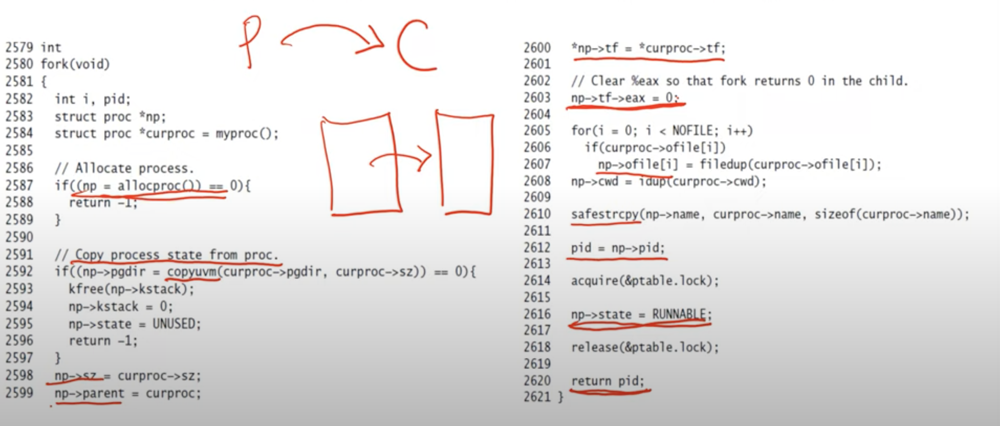

**Process system calls: Shell**
- When xv6 boots up, it starts init process (first user process)
- Init forks shell (another user process, which prompts for input)
- Shell executes user commands as follows
    * Shell reads commands from terminal
    * Shell forks child (new process created in ptable)
    * When child runs, it calls exec (rewrite code/data with that of command)
    * Shell (parent) waits for child to terminate
    * The whole process repeats again
- Some commands have to be executed by paernt process itself, and not by child
    * For example, "cd" command should change the current directory of parent (shell), not of child
    * Such commands are directly executed by shell itself without forking a child

**Main function of shell**
```c
int main(void) {
    static char buf[100];
    int fd;
    // Ensure that three file descriptors are open
    while ((fd = open("console", O_RDWR)) >= 0) {
        if (fd >= 3) {
            close(fd);
            break;
        }
    }

    // Read and run input commands
    while (getcmd(buf, sizeof(buf)) >= 0) {
        if (buf[0] == 'c' && buf[1] == 'd' && buf[2] == ' ') {
            //Chdir must be called by the parent, not the child
            buf[strlen(buf)-1] = 0; // chop \n
            if (chdir(buf+3) < 0) // calls chdir to change the directory
                printf(2, "cannot cd %s\n", buf+3);
            continue;
        }
        if (fork1() == 0) {
            runcmd(parsecmd(buf)); // calls exec system call
            wait();
        }
        exit();
    }
}
```

**What happens on a system call?**
- System calls available to user programs are defined in user library header "user.h"
    * Equivalent to C library headers (xv6 doesn't user standard C library)
    * Note that this user code is not available in PDF source code (which covers only kernel code)
- System call implementation invokes ("trap" instruction called "int" in x86)
- The trap (int) instruction causes a jump to kernel code that handles the system call
    * Before calling the int instruction, system call number moved into eax, to let kernel run the suitable code
    * More on trap instruction later

**Fork system call: overview**
- Parent allocates a new process in ptable, copies parent state to child
- Child process set to runnable, scheduler runs it at a later time
- Return value in parent is PID of child, return value in child is set to 0



**Exec system call: overview**
- Key steps:
    * Copy new executable into memory
    * Create new stack, heap
    * Switch process table to use new memory image
    * Process begins to run new code after system call ends

**Exit system call: overview**
- Exiting process cleans up state (eg. close files)
    * Note that it does not clean up all state, all state is cleaned up when the parent reaps the dead child
- Pass abandoned children (orphans) to init
- Mark itself as zombie and invoke scheduler

**Wait system call: overview**
- Search for dead children in process table
- If dead child found, clean up memory of zombie, return PID of dead child
- If no dead child, sleep until one dies

**Summary of process management system calls in xv6**
- Fork- process marks new child's struct proc as RUNNABLE, initializes child memory image and other state that is run when scheduled
- Exec- process reinitializes memory image of user code, data, stack, heaps and returns to run new code
- Exit- process marks itself as ZOMBIE, cleans up some of its state, and invokes scheduler
- Wait- parent finds any ZOMBIE child and cleans up all its state. If no dead child ter, it sleeps (marks itself as SLEEPING and invokes scheduler)