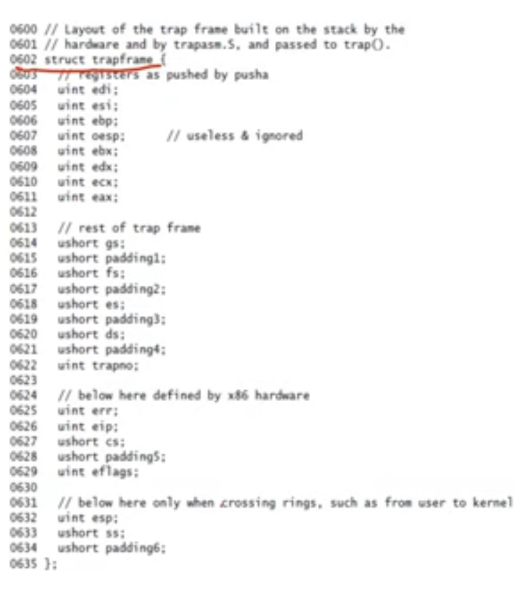
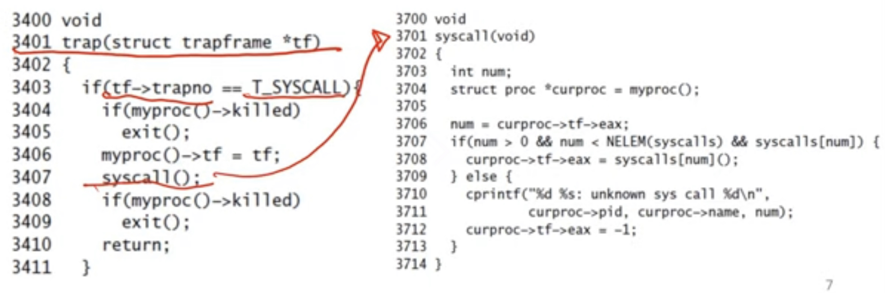
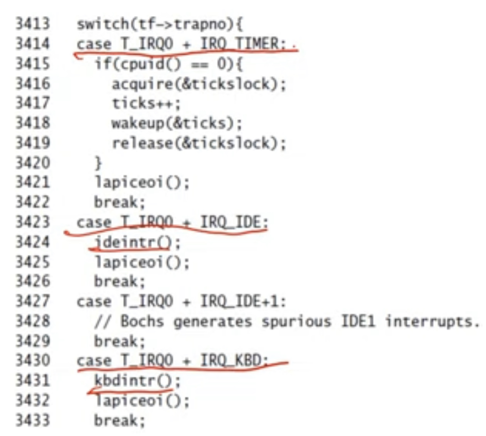
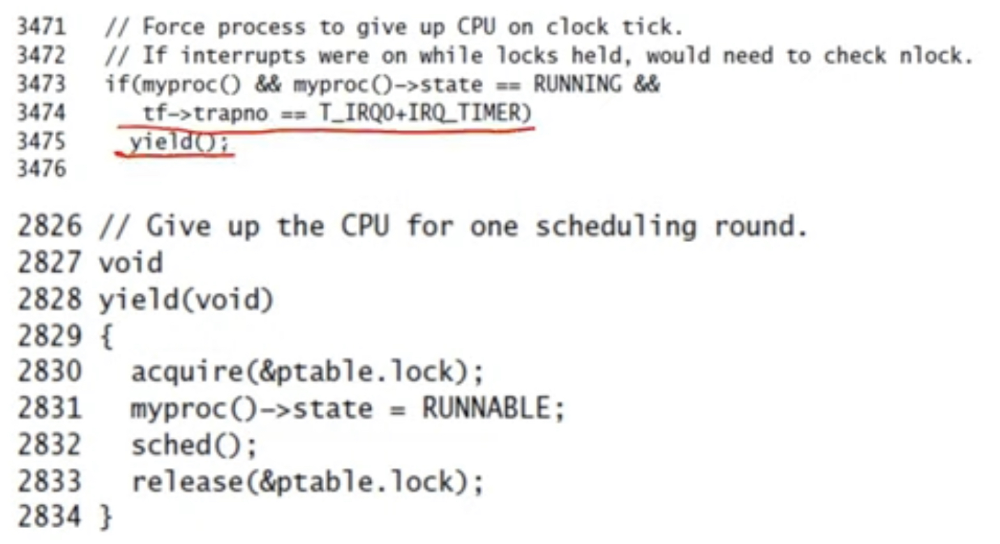
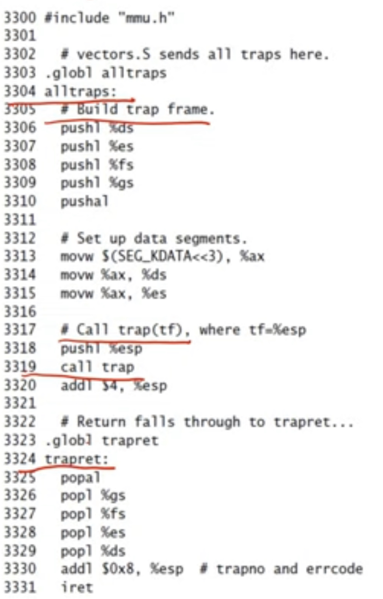

 **Trap Handling in xv6**
 - The following events cause a user process to "trap" into the kernel (xv6 refers to all these events as traps)
    - System calls (requests by user for OS services)
    - Interrupts (external device wants attention)
    - Program fault (illegal action by program)
- When above events happen, CPU executes the special "int" instruction
    * Example seen in usys.S, "int" invoked to handle system calls
    * For hardware interrupts, device sends a signal to CPU, and CPU executes int instruction
- Trap instruction has a parameter (int n), indicating type of interrupt
    * Eg. syscall has a different value of n from keyboard interrupt

**Trap instruction (int n)**
- Before trap: eip pointing to user program instruction, esp to user stack. Suppose interrupt occurs now. 
- The following steps are performed by CPU as <u>part of "int n" instruction</u>
    * Fetch n-th entry from the interrupt descriptor table (CPU knows memory address of IDT)
    * Save stack pointer (esp) to internal register
    * <u>Switch esp to kernal stack of process</u> (CPU knows location of kernel stack of current process)
    * <u>On kernel stack, save old esp, eip</u> (where execution stopped before interrupt occurred, so that it can be resumed later)
    * <u>Load new eip from IDT, points to kernel trap handler</u>
- Result: ready to run kernel trap handler code, on kernel stack of process
- Few details omitted:
    * Stack, code segments (cs, ss) and a few other registers also saved
    * Permission checks of CPU privileges levels in IDT entries (eg. user code can invoke IDT entry of system call, but not of disk interrupt)
    * If interrupt occurs when already handling previous interrupt (already on kernel stack), bno need to save stack pointer again

**Why a separate trap instruction?**
- Why can't we simply jump to kernel code, like we jump to the code of a function in a function call?
    * The CPU is executing user code in a lower privilege level, but OS code must run at a higher privilege
    * User program cannot be trusted to invoke kernel code on its own currently
    * Someone needs to <u>change the CPU privilege level and give control to kernel code</u>
    * Someone also needs to <u>switch to the secure kernel stack</u>, so that the kernel can start saving state
    * That "someone" is the CPU executing "int n"

**Trap frame on the kernel stack**
- Trap frame: state is pushed on kernel stack during trap handling
    * CPU context of where execution stopped is saved, so that it can be resumed after trap
    * Some extra information needed by trap handler is also saved
    
- Calling the "int n" instruction has so far only pushed the bottom few entries of trap frame
    * The kernel code we are about to see next will push the rest

**Kernel trap handler (all traps)**
- IDT entries for all interrupts will set eip to point to the kernel trap handler "all traps"
    * Omit details of IDT construction
- Alltraps assembly code pushes remaining registers to complete trapframe on kernel stack
    * "pushal" pushes all general purpose registers
- Invokes C trap handling function named "trap"
    * Push pointer to trapframe (current top of stack, esp) as argument to the C function
- Role of alltraps: builds the trapframe, pushes the pointer to the top of the stack as an argument (remember from previous lectures: arguments are also pushed into the stack when making a function call), calls the C trap handler function
**C trap handler function**
- C trap handler performs different actions based on kind of trap
- If system call, "int n" is invoked with "n" equal to a type T_SYSCALL (in usys.S) indicating this trap is a system call
- Trap handler invokes common system call function
    * Looks at system call number stored in eax (whether fork or exec or..) and calls the corresponding function
    * Return value of syscall stored in eax

- int n -> alltraps -> trap -> syscall (when a syscall is invoked)
- If interrupt from a device, corresponding device-related code is called
    * The trap number (value of "n" in "int n") is different for different devices
- Timer is special hardware interrupt, and is generated periodically to trap to kernel

- On timer interrupt, a process "yields" CPU to scheduler
    * Ensures a process does not run for too long

**Return from trap**
- Pop all state from kernel stack
- Return from trap instruction "iret" does the opposite of "int"
    * Pop values pushed by "int"
    * Change back privilege level
- Execution of pre-trap code can resume

**Summary of xv6 trap handling**
- <u>System calls, program faults, or hardware interrupts cause CPU to run "int n" instruction and "trap" to OS</u>
- <u>The trap instruction (int n) causes CPU to switch esp to kernel stack , eip to kernel trap handling code</u>
- <u>Pre-trap CPU state is saved on kernel stack in the trap frame (by int instruction + alltraps code)</u>
- <u>Kernel trap handler handles trap and returns from trap to whatever was running before the trap</u>