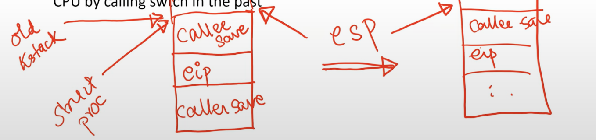

**Context switching in xv6**
- Every CPU has a scheduler thread (special process that runs scheduler code)
- Scheduler goes over list of processes and switches to one of the runnable ones
- After running for some time, the process switches back to the scheduler thread, when:
    * Process has terminated
    * Process needs to sleep (eg. blocking read system call)
    * Process yields after running for long (timer interrupt)
- Scheduler thread runs its loop and picks next process to run, and the story repeats
- Context switch only happens when process is already in kernel mode, user space process cannot simply say I want to jump to another process:
    * Example: P1 running, timer interrupt, P1 moves to kernel mode, switches to scheduler thread, scheduler switches to P2, P2 returns to user mode

**Scheduler and sched**
- Scheduler switches to user process in "scheduler" function
- User process switches to scheduler thread in the "sched" function (invoked from exit, sleep, yield)


**Who calls sched()?**
- Yield: Timer interrupt occurs, process has run enough, gives up CPU
- Exit: process has called exit, sets itself as zombie, gives up CPU
- Sleep: Process has performed a blocking action, sets itself to sleep, gives up CPU

**struct context**
- In both scheduler and sched functions, the function "swtch" switches between two "contexts"
- Context structure: set of registers to be saved when switching from one process to another
    ```c
    struct context {
        uint edi;
        uint esi;
        uint ebx;
        uint ebp;
        uint eip;
    }
    ```
    We must save "eip" where the process stopped execution, so that it can resume from same point when it is scheduled again in the future
- Context is pushed onto kernel stack, struct proc maintains a pointer to the context structure on the stack 

**Context structure vs trap frame**
- Trapframe (p->tf) also contains a pointer to some register state stored on kernel stack of a process. What is the difference?
    * Trapframe is saved when CPU switches to kernel mode (eg. eip in trapframe is eip value where syscall was made in <u>user code</u>)
    * Context structure is saved when process switches to another process (eg. eip value <u>when swtch is called in the kernel code</u>)
    * Both reside on kernel stack, struct proc has pointers to both
    * Example: P1 has timer interrupt, saves trapframe on kstack, then calls swtch, saves context structure on kstack
- Once context switch happens to process A, its context structure is restored to fill up the CPU registers whereas once return-from-trap instruction runs, user swtiches from kernel mode to user mode and goes back to the user code which called the system call. 

```c
int pid; // process ID
struct proc *parent; // parent process
struct trapframe *tf; // trap frame for current syscall
struct context *context; // swtch() here to run process
```

**swtch function**
- Both CPU thread and process maintain a context structure pointer variable (struct context *)
- swtch takes two arguments: address of old context pointer to switch from, new context pointer to switch to. It will save the old context and swtich to the new context. 
- When invoked from scheduler: address of scheduler's context pointer, process context pointer
```c
swtch(&(c->scheduler), p->context);
```
- When invoked from sched: address of process context pointer, scheduler context pointer
```c
swtch(&p->context, mycpu()->scheduler);
```
- What is on the kernel stack when a process/thread has just invoked the swtch?
    * Caller save registers (refer to C calling convention)
    * Return address (eip)
- What does swtch do?
    * Push remaining registers on old kernel stack (only callee save registers need to be saved)
    * Save pointer to this context into context structure pointer of old processs
    * Switch esp from old kernel stack to new kernel stack
    * esp now points to saved context of new process
    * Pop callee-save registers from new stack
    * Return from function call (pops return address, caller save registers)
- What will swtch find on new kernel stack? Where does it return to?
    * Whatever was pushed when the new process gave up its CPU in the past
- Result of swtch: we switched kernel stacks from old process to new process, CPU is now executing new process code, resuming where the process gave up its CPU by calling swtch in the past



**Understanding the assembly code of swtch**
- When swtch function call is made, kernel stack of old process already has: eip, arguments to swtch (address of old context pointer, new context pointer)
- Store address of old context pointer into eax
    * Address of struct context * variable in eax
- Store value of new context pointer into edx
    * edx points to new context structure
- Push callee save registers on kernel stack of old process (eip, caller save already present)
- Top of stack esp now points to complete context structure of old process. Go to address saved in eax (old context pointer) and rewrite it to point to updated context of old process
    * struct context * in struct proc is updated
- Switch stacks: copy new context pointer stored in edx (top of stack of new process) into esp
    * CPU now on stack of new process
- Pop registers from new context structure, and return from swtch in new process
    * CPU now running new process code
  


**Summary of context switching in xv6**
- What happens during context switch from process P1 to P2?
    * P1 goes to kernel mode and gives up CPU (timer interrupt or exit or sleep)
    * P2 in another process that is ready to run (it had given up CPU after saving context on its kernel stack in the past, but is now ready to run)
    * P1 switches to CPU scheduler thread
    * Scheduler thread finds runnable process P2 and switches to it
    * P2 returns from trap to user mode
- Process of switching from one process/thread to another
    * Save all register state (CPU context) on kernel stack of old process
    * Update context structure pointer of old process to this saved context
    * Switch from old kernel stack to new kernel stack
    * Restore register state (CPU context) from new kernel stack, and resume process