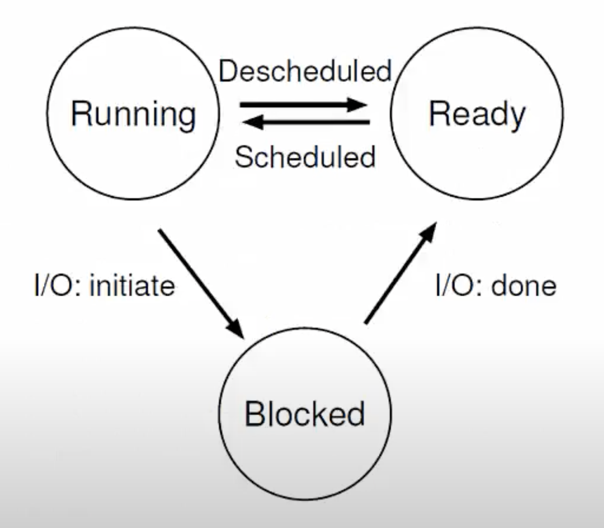
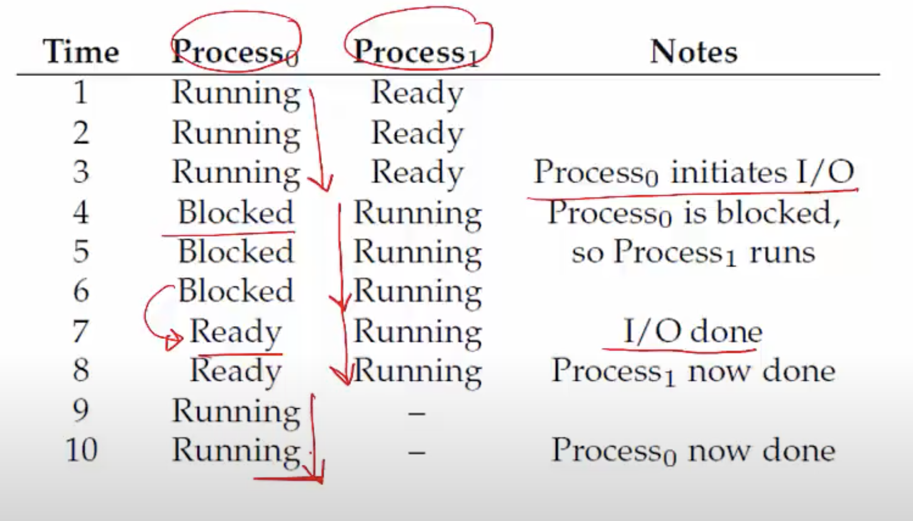

**OS provides process abstraction**

- What does it mean when we say "OS provides process abstraction"?
- When you run an exe file from command prompt/double click on an exe file, the OS creates a process = running program (process is nothing but a running program)
- OS timeshares CPU across multiple processes: <u>virtualizes CPU</u> giving each process the illusion that it is running alone on the CPU, whereas in the background, the OS is making sure that multiple processes are receiving a share of the CPU. 
- OS has a CPU scheduler that picks one of the many active processes to execute on a CPU
    * Policy: which process to run
    * Mechanism: how to "context switch" between processes

**What constitutes a process?**

- <u>A unique identifier (PID)</u>
- <u>Memory image</u> which resides in RAM:
    * Code and data (static)
    * Stack and heap (dynamic)
- <u>CPU context: registers</u>. When a process is executing, it has all of this state about itself in the CPU. 
    * Program counter -> pointing to current instruction
    * Current operands -> storing pieces of "data" from the RAM
    * Stack pointer -> pointing to current position in the stack
- <u>File descriptors</u>: pointers to open files and devices

**How does OS create a process?**

- Allocates memory and creates memory image
    * Loads code, data from disk exe
    * Creates runtime stack, heap
- Opens basic files for this process to communicate to
    * STDIN, STDOUT, STDERR
- Initializes CPU registers
    * PC points to first instruction

**States of a process**

- <u>Running</u>: currently executing on CPU
- <u>Ready</u>: waiting to be scheduled
- <u>Blocked</u>: suspended, not ready to run
    * Why? Waiting for some event, eg. process issues a read from disk
    * When is it unblocked? Disk issues an interrupt when data is ready
- New: being created, yet to run
- Dead: terminated

**Process State Transitions**

**Example: Process States**

- Here is a simple example with two processes switching between ready, running and blocked states.
- Key point to note is that once the I/O operation is done, the process goes from the blocked to the ready state, it need not be running immediately/ may not get the CPU immediately. 

**OS data structures**

- OS maintains a data structure (eg. list) of all active processes
- Information about each process is stored in a <u>process control block (PCB)</u>
    * Process identifier
    * Process state
    * Pointers to other related processes (parent)
    * CPU context of the process (saved when the process is suspended)
    * Pointers to memory locations
    * Pointers to open files
