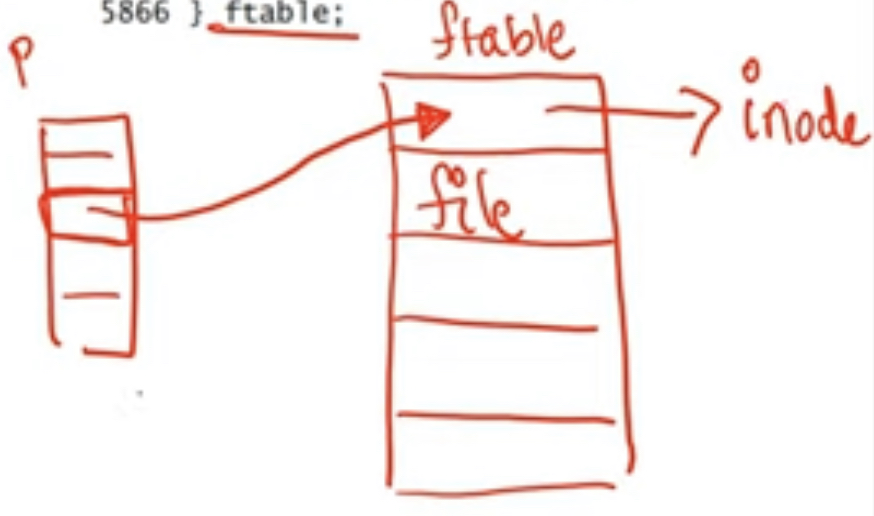

**Disk layout**
- Disk in xv6 is formatted to contain superblock, log (for crash recovery), inode blocks (multiple inodes packed per block), bitmap (indicating which data blocks are free) and actual data blocks
- Disk inode contains block numbers of direct blocks and one indirect block
- Directory is a special file: data blocks contain directory entries, mapping file names of files in the directory to corresponding inode numbers
- Link count of inode = <u>number of directory entries pointing to a file inode</u>

**In-memory data structures**
- Every open file has a struct file associated with it
    * Has pointer to inode, pipe structure etc
```c
struct file {
    enum {FD_NONE, FD_PIPE, FD_INODE} type;
    int ref; // reference count
    char readable;
    char writable;
    struct pipe *pipe;
    struct inode *ip;
    uint off;
}
```
- All struct files stored in fixed size array called file table (ftable)
```c
struct {
    struct spinlock lock;
    struct file file[NFILE];
} ftable;
```
- File descriptor array of a process contains pointers to struct files in the file table
```c
struct file *ofile[NOFILE]; // Open files
```



- Two processes P ang Q open same file, will use <u>two struct entries</u> in file table
    * <u>Points to same inode</u>
    * Read and write independently at different offsets (uint off attribute of struct file)
- P forks child C, both file descriptors will point to <u>same struct file</u> (ref attribute in struct file is increased)
    * Offsets are shared
- Reference count of struct file is number of file descriptors that point to it

**In-memory data structures (continued)**
- Struct file points to in-memory inode structure of an open file (pipe structure of pipes)
- In-memory inode is almost copy of disk inode, stored in memory for open files
- All in-memory inodes stored in fixed size array called inode cache (icache)
- Reference count (only in in-memory inode, not in disk inode) of in-memory inode is number of pointers from file table entries, current working directory of process etc/
    * Different from link count
    * A file is cleaned up on disk only when both ref count and link count are zero

**Inode functions**
- Function ialloc() allocates free inode in disk by looking over disk inodes and finding a free one for a file
- Function iget() returns a reference counted pointer to in-memory inode in icache, to use in struct file etc
    * Non-exclusive pointer, information inside inode structure may not be up to date
    * Pointer released by iput()
- Function ilock() locks the inode for use by a process, and updates its information from disk if needed
    * Unlocked by iunlock()
- Function iupdate() propagates changes from in-memory inode to on-disk inode
- Usual order of operations: ialloc -> iget -> ilock -> iupdate

**Inode functions (continued)**
- Inode has pointers to file datablocks
- Function bmap returns the address of n-th block of file
    * If direct block, read from inode
    * If indirect block, read indirect block first and then return block number from it
- Function can allocate data blocks too: if n-th data block of file not present, allocates new block on disk, writes it to inode, and returns address
- Functions readi/writei are used to read/write file data at given offset, call bmap to find corresponding data block

**Directory functions**
- Directory lookup: read directory entries from the data blocks of directory. If file name matches, return pointer to indode in icache
- Linking a file to a directory: check file with the same name does not exist, and add the mapping from file name to inode number to directory 

**Creating a file (if it doesn't exist)**
- Locate the inode of parent directory by walking the filepath from root (lookup root inode, find inode number of next element of pathname in inode data blocks (since it is a directory), and repeat)
- Lookup filename in parent directory. If file already exists, return its inode
- If file doesn't exist, allocate a new inode for it, lock it and initialize it
- If new file is a directory, add entries for "." and ".."
- If new file is a regular file, link to its parent directory

**System call: open**
- Get arguments: filename, mode (read=only or read-write)
- Create file (if specified) and get a pointer to its inode
- Allocate new struct file in ftable, and new file descriptor entry in struct proc of process pointing to the struct file in ftable
- Return index of new array in file descriptor array of process

**System call: link**
- Link an existing file from another directory with a new name (hard linking)
- Get pointer to file inode by walking the old filename
- Update link count in inode
- Get pointer to inode of new directory, and link old inode from parent directory in new name

**System call: file read**
- Other system calls follow same pattern
- For exmple, file read:
    * Get arguments (file descriptor number, buffer to read into, number of bytes to read)
    * Fetch inode pointer from struct file and perform read on inode (or pipe if file descriptor pointed to pipe)
    * Function readi uses the function "bmap" to get the block corresponding to n-th byte and reads from it
    * Offset in struct file updated

**Summary**
- On disk: inodes, data blocks, free bitmap(and log)
- In-memory: file descriptor array (points to) struct file in file table array (points to) in-memory inode in inode cache
- Directory is a special file, where data blocks contain directory entries (filenames and corresponding inode numbers)
- System calls related to files extract arguments, perform various operations on in-memory and on-disk data structures
- Updates to disk happen via the buffer cache
    * Changes to all blocks in a system call are wrapped in a transaction and logged for atomicity