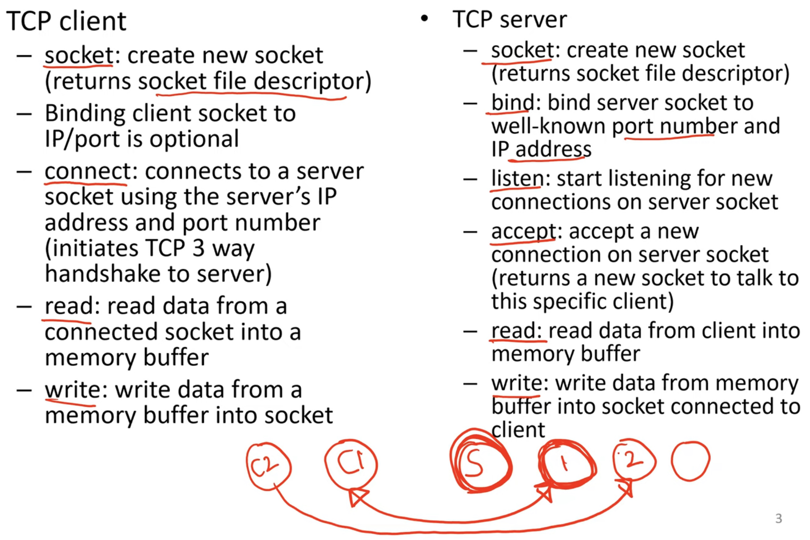

**Sockets**
- Socket API lets two processes in different machines to communicate with each other over the TCP/IP network stack
    * Unix domain sockets used for Inter Process Communication (IPC) between processes on the same machine
- Application reads/writes message into sockets, network protocol processing by kernel and network interface card (NIC)
    * Kernel handles protocol processing for higher layers (eg. L4=TCP/UDP, L3=IP, L2=Ethernet), and NIC handles lower layers (L1=physical layer)
    * Raw sockets: app receives "raw" packets directly with all headers
    * Application message boundaries are not preserved in network packets
- TCP sockets: reliable delivery, congestion control (none in UDP)
- Network socket identified by a 16-bit port number on a machine
    * Socket bound to an IP address of a network interface and a port number
- TCP socket communication: a "server" listens on a well-known port number, a "client" connects to the server, both exchange messages

**Socket system calls**

- Note the point that when the server accepts a new connection on server socket, it returns a new socket to talk to this specific client and the main server socket continues to listen for new connections

**Server design for concurrent I/O**
- What if server is talking to multiple clients concurrently?
    * Read system call blocks waiting for client data (by default)
    * Accept system call blocks waiting for new requests
    * Single process/thread of server cannot afford to block in any one of these system alls, will impact performance for other clients
- One way to handle concurrent I/O with blocking sockets: one process/thread per client
    * Multi-process: server forks a new child for each new client accepted, child process blocks on client reads, main parent server blocks on accept
    * Multi-threaded: master-worker thread pool model, master server thread blocks on accept and obtains new client sockets, worker threads handle client requests and block as needed
- Advantage of multi-process/thread design: easy to scale server to multiple cores, easy to program (each thread/process is dedicated to handling a single client and can block for the client) 
- Disadvantages of multi-process/thread design: large number of concurrent clients can exhaust server memory due to too many threads/processes in the system, need for locking and synchronization across processes/threads

**Alternative: event-driven I/O**
- Event-driven I/O: single server process/thread can simultaneously perform I/O from multiple sockets
    * Examples: select, epoll
- Overview of epoll API
    * Process creates an epoll instance, adds file descriptors of interest to be monitored
    * Process blocks on epoll_wait, which returns when there is an event on any of the file descriptors
    * Process handles events by performing suitable actions (accept, read etc) on the ready file descriptors
    * File descriptors set as non-blocking
- <u>Single-threaded server process can handle network I/O from multiple concurrent clients</u>
- Event-driven APIs available for network, not popular on disk

**Event-driver I/O: pros and cons**
- Easy to write single-threaded server, without locking and synchronization overheads across threads
- But single-threaded server cannot block for any reason
    * If the server thread blocks, server is unresponsive
- How to handle disk I/O requests from clients (as it cannot perform read system call and be blocked)?
    * In practice, multiple worker threads used in epoll server for disk I/O
- How to utilize multiple CPU cores and achieve multicore stability?
    * One thread receives events in epoll_wait, and distributes event processing to worker threads across multiple CPU cores
    * Or, multiple threads call epoll_wait and process events in parallel across mutliple CPU cores
    * Synchronization across threads needed in these scenarios
- Event-driven programming is harder, because logic to handle a client is split across multiple event handlers
    * Using a dedicated thread per client and blocking system calls leads to more readable code

**Summary**
- Socket API to build networking applications
    * Enable processes to communicate across systems using TCP/IP protocol stack
- Concurrently handling multiple clients at a server can be done in two ways
    * One process/thread dedicated to a client, blocking system calls for network I/O
    * Event-driven I/O, single process can handle multiple clients concurrently
    * Pros and cons of both techniques