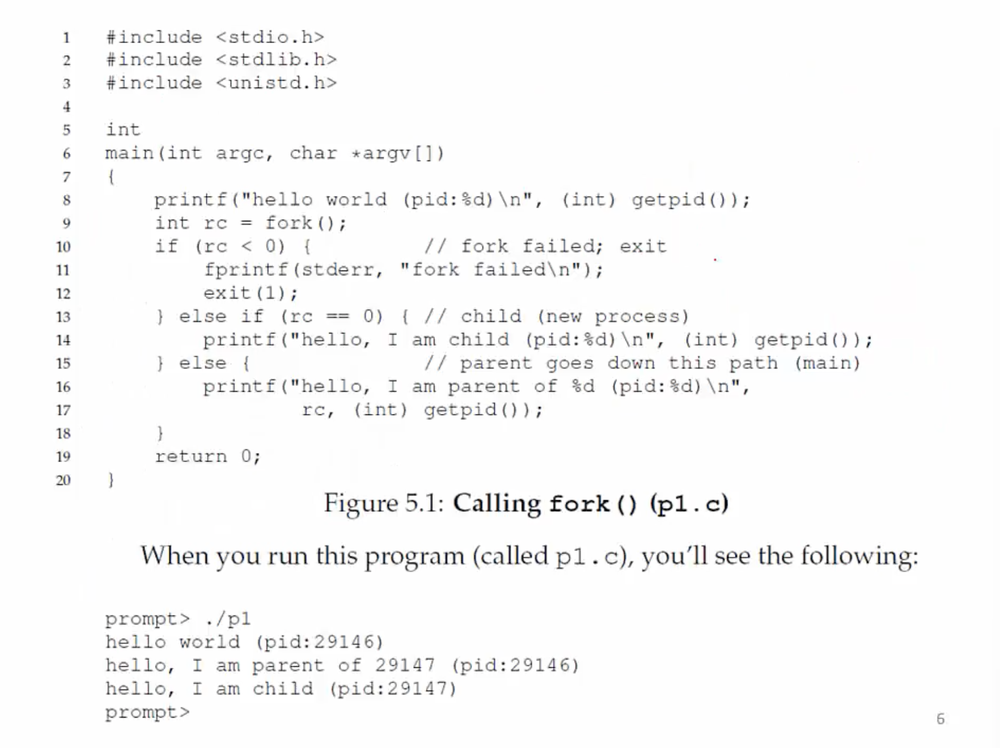
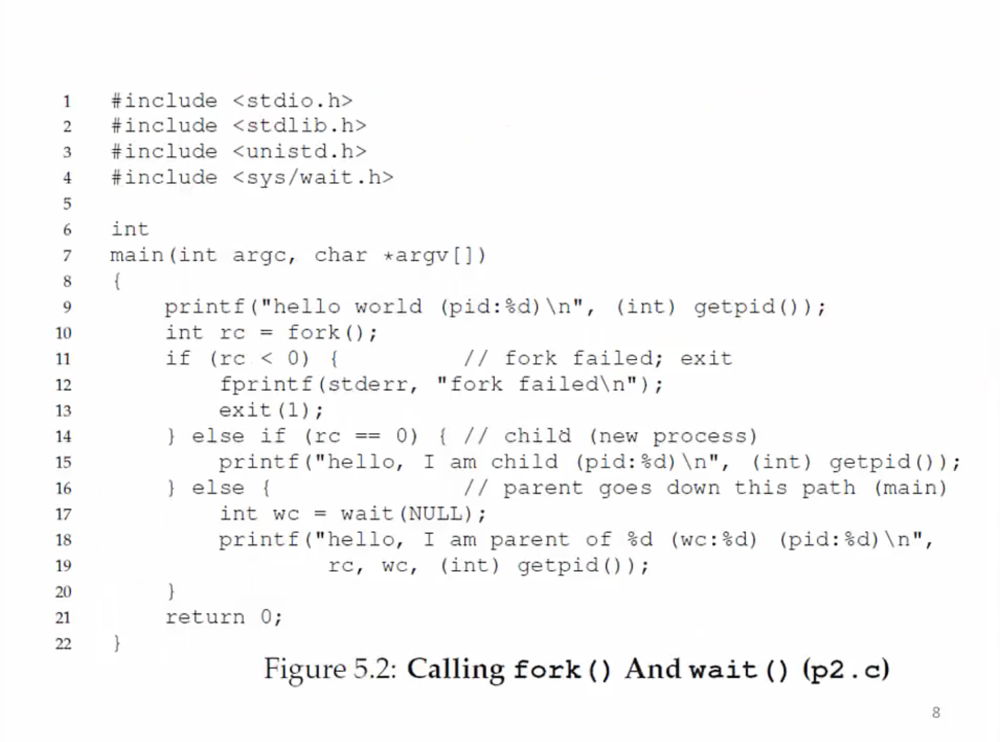
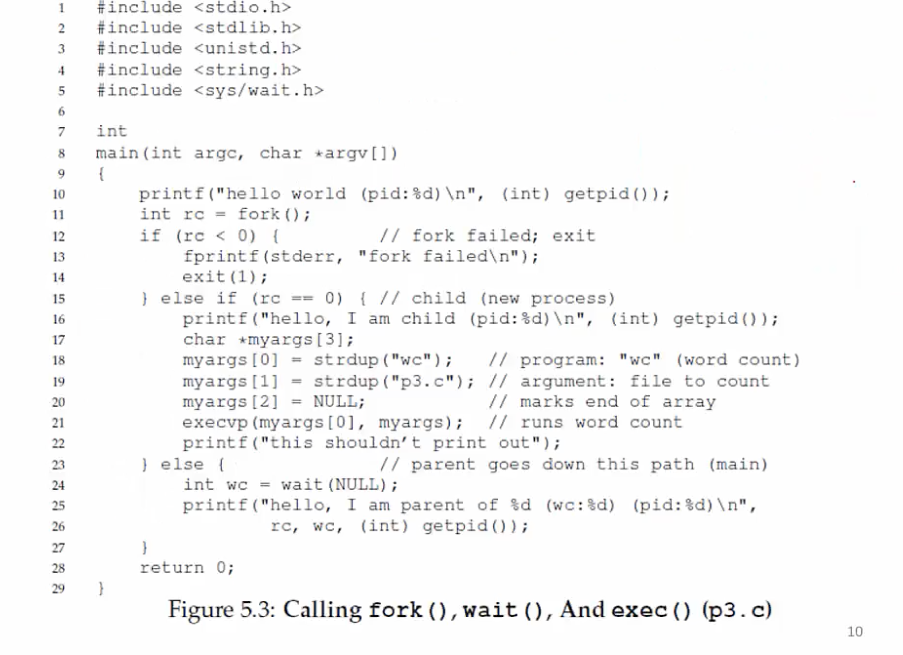
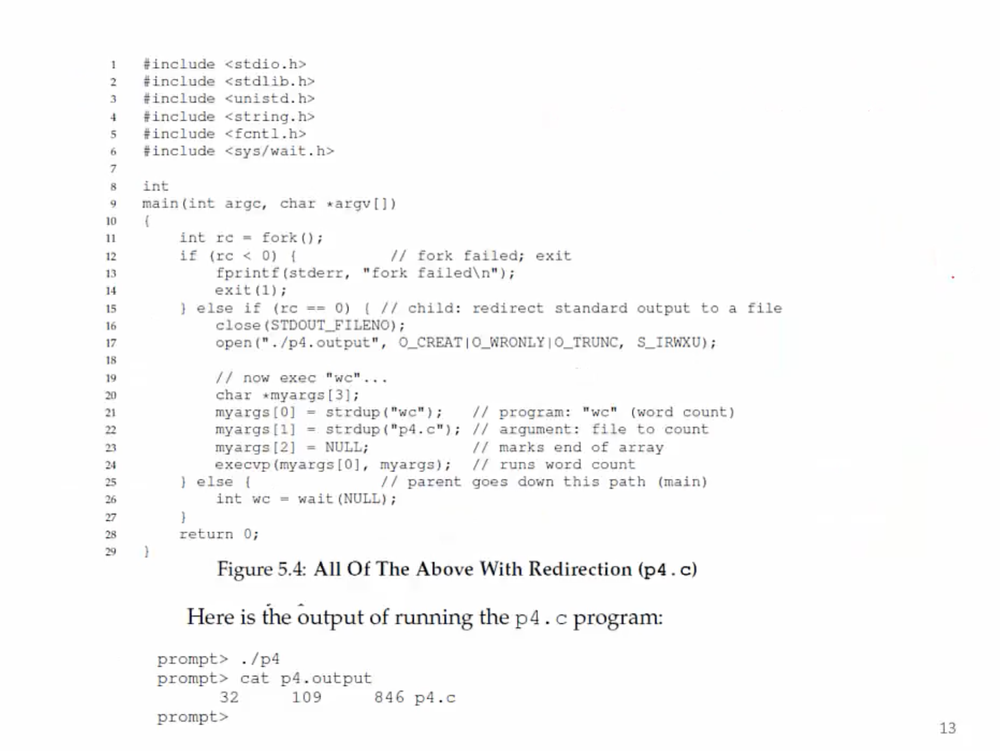

**What API does the OS provide to user programs?**
- API = Application Porgramming Interface = funtions availabe to write user programs
- API provided by OS is a set of "system calls"
    * System call is a function call into OS code that runs at a higher privilege level of the CPU
    * Sensitive operations (e.g. access to hardware) are allowed only at a higher privilege level
    * Some "blocking" system calls cause the process to be blocked and descheduled (e.g. read from the disk)
  
**Should we rewrite programs for each OS?**
- POSIX API: a standard set of system calls that an OS must implement
  - Programs written to the POSIX API can run on any POSIX compliant OS
  - Most modern OSes are POSIX compliant
  - Ensures program portability
- Program language libraries hide the details of invoking system calls
  - The printf function in the C library calls the write system call to write to screen
  - User programs usually do not need to worry about invoking system calls

**Process related system calls (in Unix)**
- fork() creates a new child process
    * <u>All processes are created by forking from a parent</u>
    * The init process is ancestor of all processes
- exec() makes a process execute a given executable
- exit() terminates a process
- wait() causes a parent to block until child terminates
- Many variants exist of the above system calls with different arguments

**What happens during a fork?**
- A new process is created by making a copy of parent's memory image
- The new process is added to the OS process list and scheduled
- Parent and child start execution just after fork (with different return values, in child- return value = 0, in parent- return value =pid of child)
- Parent and child execute and modify the memory data independently
  

**Waiting for children to die**
- Process termination scenarios 
  - By calling exit() (exit is called automatically when end of main is reached)
  - OS terminates a misbehaving process
- Terminated process exists as a zombie
- When a parent calls wait(), zombie child is cleaned up or "reaped"
- wait() blocks in parent until child terminates
  (non-blocking ways to invoke wait exist)
- What if parent terminates before child? init prcess adopts orphans and reaps them

**What happens during exec?**

- After fork, parent and child are running same code
  - Not too useful!
- A process can run exec() to load another executable to its memory image
  - So, a child can run a different program from parent
- Variants of exec(), eg. to pass commandline arguments to new executable

**Case study: How does a shell work?**
- In a basic OS, the init process is created after initialization of hardware
- The init process spawns a shell like bash
- Shell reads user command, forks a child, execs the command executable, waits for it to finish, and reads next command
- Common commands like ls are all executables that are simply exec'ed by the shell

**More funky things about the shell**
- Shell can manipulate the child in strange ways
- Suppose you want to redirect output from a command to a file
- ls > foo.txt (the output of ls will not be in the standard terminal, but rather in foo.txt)
- Shell spawns a child, rewires its standard output to a file, then calls exec on the child

- When p4.c is executed, the child is forked, its output is changed from the screen to p4.output and then "wc" is exec'ed. "wc" does not print output to screen, but rather to p4.output. Thus after ./p4, we can run "cat p4.output" to view the contents of p4.output where "wc" has outputted to. 