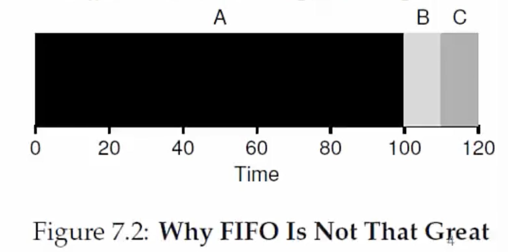
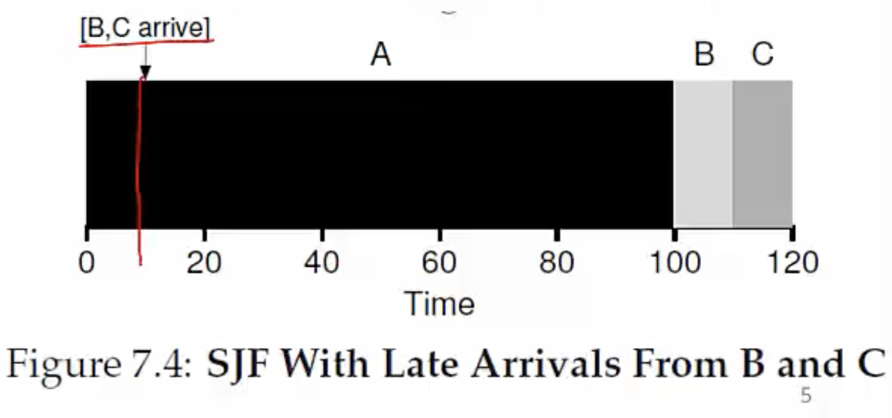
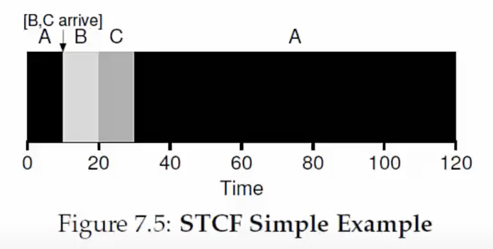
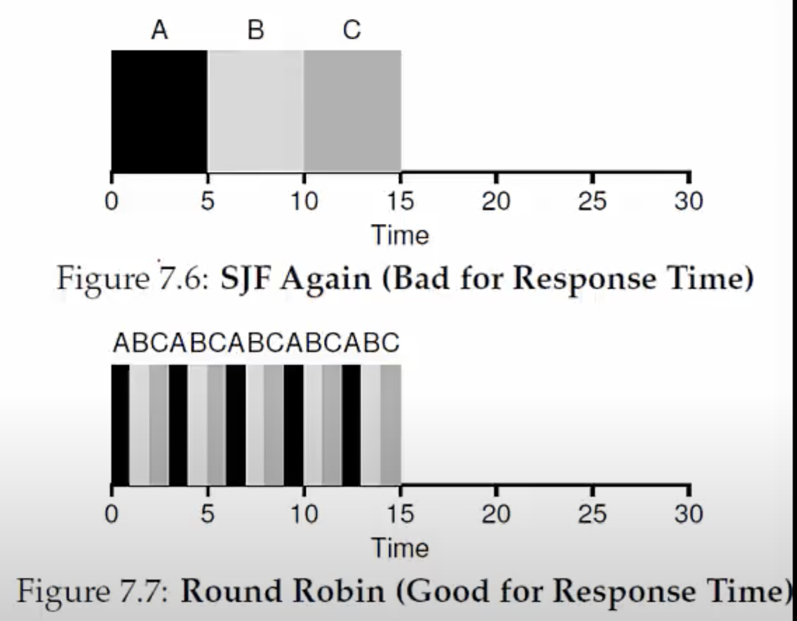

**What is a scheduling policy?**
- On context switch, which process to run next, from set of ready processes?
- OS scheduler schedules the CPU, requests (bursts) of processes
    * CPU burst = CPU time used by a process in a continuous stretch
    * If a process comes back after I/O wait, it counts as a fresh CPU burst
  
**What are we trying to optimize?**
- Maximize (utilization = fraction of time CPU is used)
- Minimize average turnaround time = time from process arrival to completion
- Minimize average response time = time from process arrival to first scheduling
- Fairness: all processes must be treated equally
- Minimize overhead: run process long enough to amortize cost of context switch (~1 microsecond)
  
**First-In-First-Out (FIFO)**
- Example: three processes arrive at t=0 in the order A, B, C
- Problem: convoy effect- sometimes you get stuck behind a really long process
- Turnaround times tend to be high

**Shortest Job First (SJF)**

- Provably optimal when all processes arrive together
- SJF is non-preemptive, so short jobs can still get stuck behind long ones. 

**Shortest Time-to-Completion First**

- Also called Shortest-Remaining-Time-First (SRTF)
- Preemptive scheduler
- Preempts running task if time left is more than that of new arrival 

**Round Robin** 

- Every process executes for a fixed quantum slice
- Slice big enough to amortize cost of context switch
- Preemptive
- Good for response time and fairness
- Bad for turnaround time

**Schedulers in real systems**

- Real schedulers are most complex
- For eg, Linux uses a Multi Level Feedback Queue (MLFQ)
    * Many queues, in order of priority
    * Process from highest priority queue scheduled first
    * Within same priority, any algorithm like RR
    * Priority of process decays with age