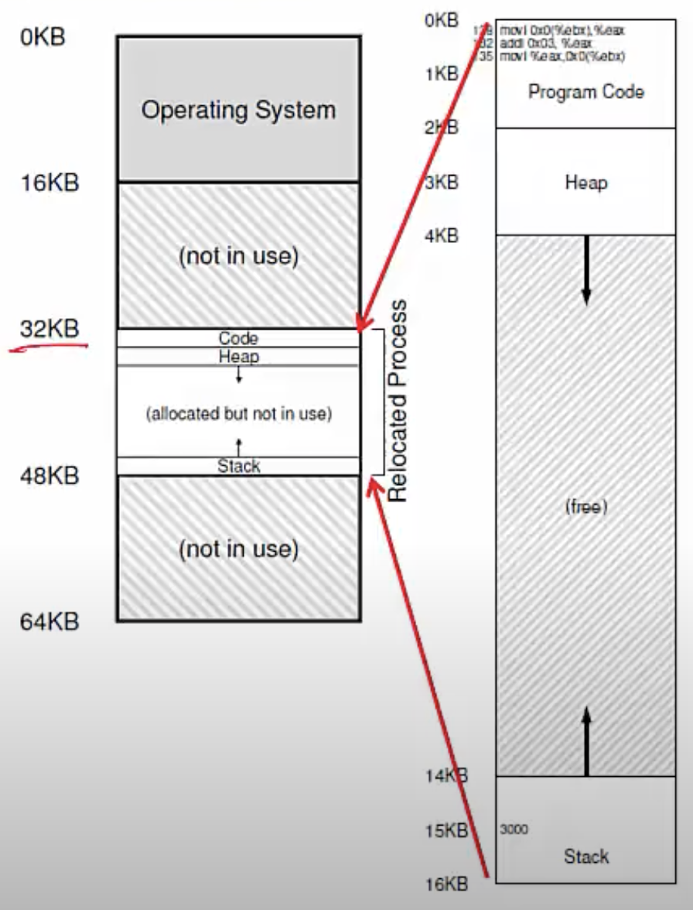
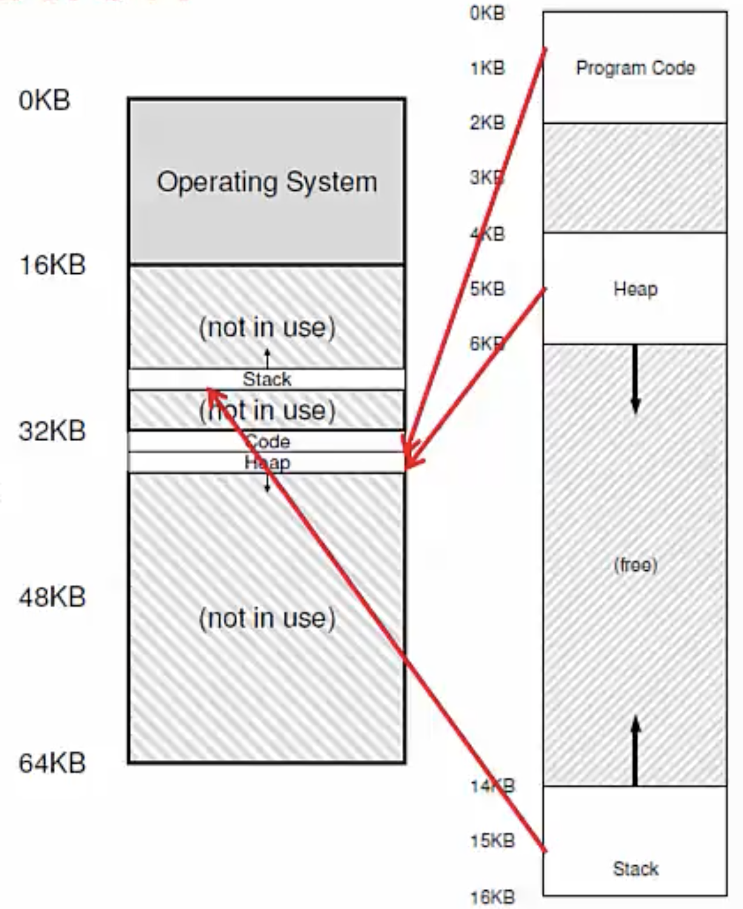

**A simple exam**

- Consider a simple C function
```c
void func() {
    int  x = 3000;
    x = x + 3;
}
```
- It is compiled as follows
```
128: movl 0x0(%ebx), %eax ; load 0 + ebx into eax
132: addl $0x03, %eax ; add 3 to eax register
135: movl %eax, 0x0(%ebx) ; store eax back to mem
```
- Virtual address space is setup by OS during process creation 
- And this virtual address space is managed by the OS
    * Anytime you need more memory on the heap, you can make a few system calls

**Address Translation**



- Simplified OS: places entire memory image in one chunk
    * All of this memory image is placed into part of physical memory starting at address 32KB
    * In real life, all of this may not be placed in one chunk- with paging, OS will split this into different pages and will distribute this all over the RAM

- Need the following translation from VA to PA
    * 128 to 32896 (32KB + 128). CPU will say fetch address 128, and it will be translated to 32896. 
    * 1KB to 33KB
    * 20KB? Error!

**Who performs address translation?**
- In this simple example (where the entire process image is placed in one chunk), OS tells the hardware the base (starting address) and bound (total size of process) values
- Memory hardware Memory Management Unit (MMU) calculates PA from VA
    * physical address (33KB)= virtual address (1KB) + base (32KB)
- MMU also checks if address is beyond bound
- OS is not involved in every translation (all what OS does is provide the base and bound values to the MMU)

**Role of hardware in translation**
- CPU provides privileged mode of execution
- Instruction set has privileged insructions to set translation information (eg. base, bound)
- Hardware (MMU) uses this information to perform translation on every memory access
    * Role of OS is to only provide base, bound values
- MMU generates faults and traps to OS when access is illegal (eg. VA is out of bound)

**Role of OS in translation**
- OS maintains free list of memory
- Allocates space to process during creation (and when asked) and cleans up when done
- Maintains information of where space is allocated to each process (in PCB)
- Sets address translation information (eg. base and bound) in hardware
- <u>Updates this information upon context switch</u>
    * "Hey, you were using this base and bound value of process A earlier, now I've switched to process B, use this new base and bound value of process B"
- Handles traps due to illegal memory access


**Segmentation**
- Generalized base and bounds
- Each segment of memory image placed separately

- Multiple (base, bound) values stored in MMU
- Good for sparse address space
    * When there is a lot of unused memory in address space; there's no reason why this entire 16KB should be given you in memory when you've used so little
    * Instead, place each of the smaller chunks separately into memory
- But variable sized allocation leads to external fragmentation
    * Small holes in memory left between segments which are too small to be useful and result in wastage of memory
    * Which is why segmentation is not such a popular technique